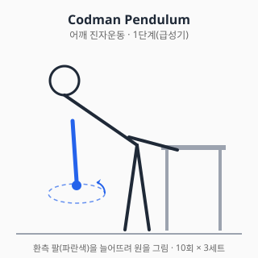
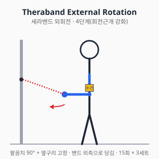

# 어깨 통증 — 진단과 치료

<!-- DISCLAIMER_BANNER_AUTO -->

## 0. 해부학 개요

- **관절 (4개)**: 견관절(GH, glenohumeral), 견봉쇄골관절(AC), 흉쇄관절(SC),
  견갑흉곽관절(ST, scapulothoracic)
- **회전근개 (Rotator Cuff, RC)**: 극상근(supraspinatus), 극하근(infraspinatus),
  소원근(teres minor), 견갑하근(subscapularis)
- **견봉하공간 (subacromial space)**: 점액낭(SA bursa) + 극상건이 통과하는 좁은 통로
- **상완이두근 장두건 (LHB)**: 결절간구(bicipital groove)를 따라 주행

## 1. 흔한 증상·질환 (감별진단표 + 본문)

| 임상 양상 | 의심 질환 |
|---|---|
| 팔 들 때 60~120°에서 통증 (painful arc) | 견봉하 충돌증후군 / 회전근개 부분파열 |
| 야간통 + 능동운동 불가 | 회전근개 전층파열 |
| 모든 방향 능·수동 ROM 제한 (특히 외회전) | 유착성 관절낭염(동결견) |
| 어깨 앞쪽 통증 + 결절간구 압통 | 이두건염 (LHB tendinopathy) |
| 외상 후 변형 + 즉시 사용 불가 | 탈구 / 골절 (응급) |
| 50~60대 양측 어깨·골반 강직 + ESR↑ | 류마티스성 다발근통(PMR) — 비정형, 감별 필수 |

### 1.1 회전근개 질환 (Rotator Cuff Disorders)

- 스펙트럼: 건염 → 부분파열 → 전층파열 → 광범위파열 + 지방변성(Goutallier 분류)
- 유병률: 60세 이상 무증상자에서도 영상학적 파열이 약 30% 이상 보고됨 (Yamamoto 2010)
- 자연경과: 부분파열의 일부는 시간 경과로 전층파열로 진행할 수 있다는 보고가 있다.
- 예후 인자: 파열 크기, 지방변성 단계, 환자 연령·활동도

### 1.2 견봉하 충돌증후군 (Subacromial Impingement Syndrome)

- 외인성(견봉 형태 Type III hook 등)과 내인성(건 자체 퇴행) 기전이 공존한다는 가설이 있다.
- Neer 3단계: ① 부종·출혈 ② 섬유화·건염 ③ 파열·골극 형성
- 명명 변화: "충돌"이라는 단일 개념에서 **회전근개 관련 어깨통증(RCRSP,
  Rotator Cuff Related Shoulder Pain)**으로 포괄 명명하는 추세 (Lewis 2016).

### 1.3 유착성 관절낭염 = 동결견 (Frozen Shoulder, Adhesive Capsulitis)

- 3단계: 동통기(painful) → 동결기(frozen) → 해동기(thawing). 평균 18~24개월에 걸쳐 진행한다는 보고.
- 위험인자: **당뇨**(유병률 일반인의 2~4배), 갑상선질환, 여성, 40~60대
- 핵심 소견: **능동·수동 ROM 모두 제한** (특히 외회전 제한이 특징)

### 1.4 석회화건염 (Calcific Tendinitis)

- 극상건 호발. 형성기 → 휴지기 → 흡수기. 흡수기에 극심한 통증.
- X-ray로 진단하며, 흡수기에 자연관해되는 경향이 있다.

### 1.5 견관절 불안정성 (Instability)

- 외상성(TUBS, Traumatic Unilateral Bankart Surgery): 전방탈구 + Bankart 병변
- 비외상성(AMBRI, Atraumatic Multidirectional Bilateral Rehabilitation Inferior capsular shift):
  다방향 불안정, 운동치료 우선

## 2. 자가 체크리스트 (Red Flag)

다음 중 **하나라도 해당**되면 자가관리 중단하고 즉시 진료:

- ✋ 외상 후 변형 또는 즉시 사용 불가
- 🌡️ 발열 동반 (감염성 관절염 감별)
- 🌙 야간통으로 수면 불가가 4주 이상 지속
- 🤲 손·팔의 근력 저하 (4/5 미만), 감각저하, 마비
- ⚖️ 양측성 어깨통증 + 체중감소 (전신질환·악성종양 감별)
- ❤️ 흉통·호흡곤란 동반 (심근경색·대동맥박리 감별 — 응급)

## 3. 진단 (의사 영역)

### 3.1 신체검사

| 검사 | 평가 대상 |
|---|---|
| Neer test | 견봉하 충돌 |
| Hawkins-Kennedy test | 견봉하 충돌 |
| Empty Can (Jobe) test | 극상근 |
| Apprehension test | 전방 불안정 |
| Speed / Yergason test | 상완이두건염 |
| External rotation lag sign | 극하근 전층파열 |

### 3.2 영상검사

- **X-ray**: AP / Y-view / axillary view — 골성 변화, 견봉 형태(Bigliani Type I/II/III),
  AC 관절, 견갑상부 골극, 칼슘 침착
- **초음파**: 회전근개 파열 일차 평가 (검사자 의존성 있음)
- **MRI**: 파열 크기·근육 퇴축·지방변성 평가, 연부조직 종양 감별
- **MR arthrogram**: 관절순 병변(SLAP, Bankart) 평가

## 4. 치료

### 4.1 약물 (약사 영역)

> ⚠️ 처방약 정보는 의사 처방·약사 복약지도 하에 사용. 본 섹션은 교육 목적.

**약 복용 중 흔한 환자 자연어 호소와 대응 안내 (모든 약 공통)**

- **"약 먹고 속이 쓰려요" / 위장 불편 / 속쓰림 / 명치 통증**
  → NSAID(이부프로펜·나프록센·셀레콕시브·디클로페낙) 위장 부작용 가능. 식후 복용·PPI 병용 검토. 흑변·토혈 시 즉시 진료.
- **"약 먹고 너무 졸려요" / 어지러움 / 멍함**
  → 트라마돌·근이완제(에페리손·톨페리손)·항우울제(듀록세틴·아미트립틸린)·신경병성 진통제(가바펜틴·프레가발린) 진정 작용. 운전·기계조작 주의. 알코올·다른 진정제 병용 회피.
- **"위장약이랑 같이 먹어도 돼요" / 위 보호제 병용**
  → PPI(오메프라졸·에소메프라졸 등) 병용은 NSAID 위장 부작용 줄임. 약사와 상담 후 사용.
- **"수유 중인데 약 먹어도 돼요"**
  → 아세트아미노펜·이부프로펜은 단기 사용 시 일반적으로 모유 안전성 양호 보고. 그 외 약은 의사·약사와 사전 상담. 본 위키는 안전 단정을 제공하지 않으며 개별 상담 권고.
- **"임신 중인데 약"**
  → NSAID는 임신 후기(20주 이후) 일반적으로 회피. 아세트아미노펜이 1차 선택으로 흔히 사용. 반드시 산부인과·약사 상담.
- **"약을 끊어도 돼요" / 의존성**
  → 단순 진통제(NSAID·아세트아미노펜)는 통증 호전 시 중단 가능. 트라마돌·아편유사제·가바펜틴·프레가발린은 갑자기 끊으면 금단 가능 → 의사 지도 하 점진적 감량.

- **"주사 말고 보존치료 / 처방 없이 자가관리 / 약 빼고 다른 방법"**
  → **약물·주사 없이 보존치료** 가능한 영역도 많습니다. 단순 통증·초기 단계라면:
  운동치료(재활), 자가 스트레칭, 물리치료, 휴식·얼음·압박·거상(RICE), 자세 교정·생활습관 변경이 1차 선택일 수 있습니다.
  단 Red Flag·만성 통증·기능 제한 시 의사 진료가 필요합니다.

#### A. 일반의약품 (OTC) — 단기 통증 조절

##### A-1. 아세트아미노펜 (Acetaminophen / Paracetamol) — 타이레놀

- **기전**: 중추 COX-2 억제 우세로 추정 (말초 항염 효과 약함)
- **용법**: 성인 500~1000mg q4~6h, 최대 4g/일 (간기능 정상 기준).
  음주자·간질환자는 2g/일 이하 권고.
- **주의**: 와파린과 병용 시 INR 상승 보고가 있다. 1주 이상 4g/일 사용 시 간독성 위험.
- **상호작용**: 와파린(INR↑), 알코올(간독성↑), 이소니아지드(간독성↑)

##### A-2. 이부프로펜 (Ibuprofen) — 부루펜

- **기전**: 비선택적 COX-1/2 억제 → 프로스타글란딘 합성 차단
- **용법**: 성인 200~400mg q4~6h, OTC 최대 1200mg/일, 처방 시 최대 3200mg/일
- **주의**:
  - GI: 위장관 궤양·출혈 (고령·기왕력자 PPI 병용 고려)
  - 신장: 만성 사용 시 신기능 저하, 탈수 시 AKI 위험
  - 심혈관: 장기 고용량 시 MI·뇌졸중 위험 증가 보고 (FDA 경고)
- **상호작용**:
  - 저용량 아스피린: 항혈소판 효과 감쇄 (복용 간격 2시간 이상)
  - ACEi / ARB / 이뇨제: "Triple whammy" AKI 위험
  - 와파린: 출혈 위험↑
  - SSRI: 위장관 출혈↑
  - 리튬 / 메토트렉세이트: 혈중농도↑ (독성 위험)

##### A-3. 나프록센 (Naproxen) — 낙센, 탁센

- **기전**: 비선택적 NSAID, 반감기 12~17h (1일 2회 투여)
- **용법**: 250~500mg q12h, 최대 1000mg/일 (OTC는 보통 220mg/회)
- **특징**: 비선택 NSAID 중 심혈관 위험이 상대적으로 낮다는 메타분석 보고가 있다
  (Trelle 2011).
- **상호작용**: NSAID 일반 (이부프로펜 항목 참조)

##### A-4. 국소 NSAID (디클로페낙 겔 / 패치, 피록시캄 겔)

- 대표 상품: 케토톱, 트라스트, 볼타렌 겔
- **기전**: 경피흡수 후 국소 COX 억제, 전신 노출은 약 5~15% 수준
- **장점**: 고령·신기능 저하·GI 위험군에서 1차 선택지로 권고된다
  (NICE NG226, 무릎·손 OA 강한 권고).
- **주의**: 광과민, 적용부위 피부염

#### B. 처방약 (의사 판단)

##### B-1. 선택적 COX-2 억제제 (Celecoxib) — 쎄레브렉스

- **기전**: COX-2 선택 억제 → GI 부작용 감소, COX-1 매개 항혈소판 효과 없음
- **용법**: 200mg/일 ~ 400mg/일 (분할 또는 1회)
- **주의**:
  - 심혈관 위험은 비선택 NSAID와 유사하다는 PRECISION 연구 결과가 있다 (Nissen 2016).
  - Sulfonamide 알레르기 주의
- **상호작용**: 와파린(INR↑), ACEi/이뇨제(신기능↓), 플루코나졸(혈중↑)

##### B-2. 트라마돌 (Tramadol)

- **기전**: 약한 μ-opioid agonist + SNRI 활성 (이중 기전)
- **용법**: 50~100mg q4~6h, 최대 400mg/일
- **주의**:
  - **세로토닌 증후군**: SSRI/SNRI/MAOI 병용 시 위험
  - 경련 역치 저하
  - 의존성 가능 (대한민국 마약류 관리)
- **상호작용**: SSRI/SNRI(세로토닌 증후군), 와파린(INR↑),
  CYP2D6 강억제제(파록세틴 등)로 활성 대사체 형성 감소 → 진통 효과 저하

##### B-3. 근이완제 (Eperisone, Tolperisone) — 뮤렉스, 에페리손

- **기전**: 중추 작용성 근이완 (척수 반사 억제)
- **용법**: 에페리손 50mg tid (1일 3회)
- **주의**: 졸음, 위장장애, 드물게 아나필락시스(특히 톨페리손)
- **근거 한계**: 어깨 통증에서 단독 근거는 약함. 보조요법으로만 고려.

##### B-4. 국소 코르티코스테로이드 주사 (의사 시술)

> ※ 본 항목은 약물 정보 제공이며, 실제 시술은 정형외과·통증의학과·재활의학과
> 의사가 시행합니다.

- **약제**: 트리암시놀론, 덱사메타손, 메틸프레드니솔론
- **적응**: 견봉하공간 주사(충돌·회전근개건염), 관절강내 주사(동결견·관절염)
- **기전**: 강력 항염, 부종 감소
- **주의 (의사 판단)**:
  - 동일 부위 연 3~4회 이내 권고 (건파열 위험 보고)
  - 당뇨 환자 일시적 혈당 상승
  - 무균술 필수 (감염 위험)
- **근거**: 단기(6~12주) 통증 개선은 강한 근거, 장기 효과는 제한적이라는
  Cochrane 리뷰가 있다 (Buchbinder 2003).

##### B-5. 히알루론산 관절강 주사

- 어깨에서의 근거는 무릎 OA보다 약하다.
- **국내 급여 기준 (참고)**: 식약처 허가는 무릎 OA 위주이며, 어깨에 대한
  급여 인정은 제한적이다. 실제 적용 전 보건복지부 고시·심평원 기준을
  확인할 것 (조회일: 2026-06-06 기준 변동 가능).

#### C. 신경병증성 통증 동반 시

- 가바펜틴(Gabapentin), 프레가발린(Pregabalin / 리리카) — 견갑상신경 포착 등
  적응 외 사용 영역. 의사 판단.

#### D. 상호작용 풀세트 — 한눈에 보기

| 약물 A | 약물 B | 상호작용 |
|---|---|---|
| 이부프로펜 | 저용량 아스피린 | 항혈소판 효과 감쇄 |
| NSAID 일반 | ACEi/ARB + 이뇨제 | Triple whammy (AKI) |
| NSAID 일반 | 와파린 | 출혈 위험↑ |
| NSAID 일반 | SSRI | 위장관 출혈↑ |
| NSAID 일반 | 리튬 / MTX | 혈중농도↑ → 독성 |
| 트라마돌 | SSRI / SNRI / MAOI | 세로토닌 증후군 |
| 트라마돌 | CYP2D6 억제제 | 진통 효과 감쇄 |
| 셀레콕시브 | 플루코나졸 | 셀레콕시브 혈중↑ |
| 아세트아미노펜 | 와파린 | INR↑ (만성 사용) |
| 트라마돌 | 알코올 | 중추신경 억제↑ |

#### 약물 섹션 출처

- 식약처 의약품안전나라. https://nedrug.mfds.go.kr (조회일: 2026-06-06)
- Trelle S, et al. Cardiovascular safety of non-steroidal anti-inflammatory drugs:
  network meta-analysis. BMJ. 2011;342:c7086. doi:10.1136/bmj.c7086
- Nissen SE, et al. Cardiovascular Safety of Celecoxib, Naproxen, or Ibuprofen
  for Arthritis (PRECISION). N Engl J Med. 2016;375:2519-2529. doi:10.1056/NEJMoa1611593
- NICE Guideline NG226. Osteoarthritis in over 16s. 2022.
  https://www.nice.org.uk/guidance/ng226
- Buchbinder R, Green S, Youd JM. Corticosteroid injections for shoulder pain.
  Cochrane Database Syst Rev. 2003;(1):CD004016. doi:10.1002/14651858.CD004016
- Lexicomp Drug Interactions Database (보조 참고)

### 4.2 물리치료 (물리치료사 영역)

#### 급성기 (0~2주, 통증·염증 우세)

- **한랭치료(Cryotherapy)**: 15~20분/회, 1일 3~4회
- **TENS** (Transcutaneous Electrical Nerve Stimulation): 통증 gate 이론
- 근거: 단기 통증 감소 (Page MJ Cochrane 2016)

#### 아급성기 (2~6주)

- **온열치료**: 심부 가열(초음파, 단파) — 조직 신장 직전 적용
- **도수치료**: 관절가동술(Mulligan MWM, Maitland) — 동결견·충돌에서 ROM 개선 보고

#### 만성기 (6주~)

- **체외충격파 (ESWT)**: 석회화건염에서 비교적 강한 근거 (집속형 권고)
- 도수치료 지속, 운동치료 비중↑

#### 금기·주의

- 종양·감염·골절 의심 시 모달리티 적용 금지
- 인공심박동기 환자에서 단파·초음파 적용 신중
- 출혈 경향 환자에서 도수치료 신중

### 4.3 스트레칭·재활운동 (재활치료사 영역)

#### 1단계 — 진자운동 (Codman pendulum) — 급성기

- **자세**: 허리 숙이고 환측 팔을 늘어뜨림
- **동작**: 시계방향·반시계방향 원 그리기, 전후좌우 흔들기
- **횟수**: 각 방향 10회 × 3세트/일
- **목적**: 통증 없이 GH 관절 미세 가동

#### 2단계 — 수동 ROM (Wand exercise, 막대운동) — 아급성기

- **외회전**: 막대를 양손으로 잡고 환측을 외회전 방향으로 밀기 (10초 유지 × 10회)
- **굴곡**: 누워서 막대로 양손 들어올리기

#### 3단계 — 능동 ROM + 등척성 운동 (Isometric)

- **벽 밀기**(외회전·내회전): 통증 없는 범위에서 5초 × 10회

#### 4단계 — 회전근개 강화 (Theraband)

- **외회전 (ER)**: 팔꿈치 90° 굽힘, 옆구리 고정, 밴드를 외측으로 당김
- **내회전 (IR)**: 반대 방향
- **견갑면 거상 (Scaption)**: 엄지 위로, 30° 전방 면에서 거상
- **횟수**: 15회 × 3세트, 주 3회

#### 5단계 — 견갑골 안정화 (Scapular Stabilization)

- **Y-T-W-L 운동**: 엎드린 자세, 1kg 이하 덤벨
- **Wall slide**, **Serratus punch**
- 근거: 견갑 운동조절 개선이 충돌·RCRSP 통증 감소와 연관된다는 보고
  (Cools 2014).

#### 6단계 — 근력·기능 회복 (스포츠 복귀)

- **Push-up plus**, **Closed kinetic chain** (벽 push-up → 무릎 push-up → 정자세)
- 던지기 선수: **Thrower's Ten** 프로그램

#### 운동 중단 신호

- 통증 점수 NRS 5/10 초과 → 강도 하향
- 운동 중 "뚝" 소리, 갑작스런 약화 → 즉시 중단·진료
- 야간통 악화 → 단계 다운

#### 물리·재활 출처

- Page MJ, et al. Manual therapy and exercise for rotator cuff disease.
  Cochrane Database Syst Rev. 2016;6:CD012224. doi:10.1002/14651858.CD012224
- Cools AM, et al. Rehabilitation of scapular dyskinesis: from the office worker
  to the elite overhead athlete. Br J Sports Med. 2014;48(8):692-697.
  doi:10.1136/bjsports-2013-092148
- Kelley MJ, et al. Shoulder pain and mobility deficits: adhesive capsulitis.
  JOSPT Clinical Practice Guideline. 2013. doi:10.2519/jospt.2013.0302

## 5. 수술·전문의 의뢰 기준

### 5.1 회전근개 봉합술 (관절경 또는 개방)

- **적응증**: 전층파열 + 보존치료 3~6개월 실패, 외상성 급성 파열, 기능요구 높은 환자
- **상대적 비적응**: 광범위 파열 + Goutallier 3~4단계 지방변성 → 봉합 실패율 높음

### 5.2 견봉성형술 (Acromioplasty)

- 단독 시행은 근거가 약화되는 추세. 회전근개 봉합술의 부수적 시행이 일반적.

### 5.3 관절경적 관절순 봉합술 (Bankart Repair)

- **적응증**: 재발성 전방 탈구, 청년·고활동
- **Latarjet 술식 고려 기준**: 견갑와 골소실 20~25% 이상

### 5.4 역행성 견관절치환술 (Reverse TSA)

- **적응증**: 회전근개 결손 관절병증(CTA, Cuff Tear Arthropathy), 광범위
  비봉합성 파열 + 가성마비

### 5.5 의뢰 결정 요약

- 보존치료 3~6개월 무반응
- 전층파열 + 기능요구 높음
- 외상성 탈구 재발 (특히 청년층)
- 신경학적 결손 동반

### 의사 섹션 출처

- Yamamoto A, et al. Prevalence and risk factors of a rotator cuff tear in the
  general population. J Shoulder Elbow Surg. 2010;19(1):116-120.
  doi:10.1016/j.jse.2009.04.006
- Lewis J. Rotator cuff related shoulder pain: Assessment, management and
  uncertainties. Man Ther. 2016;23:57-68. doi:10.1016/j.math.2016.05.009
- AAOS Clinical Practice Guideline. Management of Rotator Cuff Injuries. 2019.
  https://www.aaos.org/quality/quality-programs/upper-extremity-programs/rotator-cuff/
- 대한견·주관절학회. 견관절질환 진료지침. (학회 공식 출판물)
- UpToDate. Evaluation of the adult with shoulder complaints. (보조 참고)

## 6. 통합 참고문헌 (이 페이지 전체)

위 각 섹션 말미의 출처를 통합 정리. 새로운 출처가 추가될 때만 본 섹션을 확장.

## 7. 작성·검토·최종수정일

- 의사: TBD
- 약사: TBD
- 물리치료사: TBD
- 재활치료사: TBD
- 감사역 검수: 통과 (2026-06-06)
- 최종수정일: 2026-06-06
- 버전: 0.1.0
