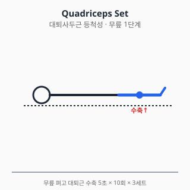
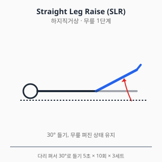
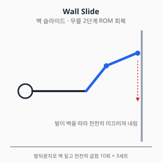
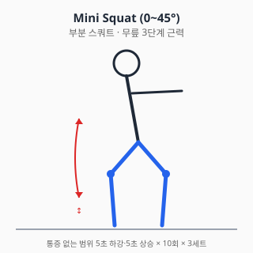

# 무릎 통증 — 진단과 치료

<!-- DISCLAIMER_BANNER_AUTO -->

## 0. 해부학 개요

- **관절**: 슬관절 (대퇴–경골, 대퇴–슬개) + 슬개대퇴관절(PFJ)
- **인대 (4대)**: 전방십자인대(ACL), 후방십자인대(PCL),
  내측측부인대(MCL), 외측측부인대(LCL)
- **연골판**: 내측·외측 반월상연골 (충격흡수, 하중분산)
- **건**: 슬개건(patellar tendon), 대퇴사두건(quadriceps tendon)
- **활액낭**: 슬개전·심부 등 여러 부위에 분포

## 1. 흔한 증상·질환 (감별진단표 + 본문)

| 임상 양상 | 의심 질환 |
|---|---|
| 외상 후 "뚝" 소리 + 즉시 부종 (수시간 이내) | 전방십자인대(ACL) 파열 ± 반월상연골 손상 |
| 무릎 잠김(locking) / 끼임 / 신전 제한 | 반월상연골 파열 (bucket handle) |
| 계단·앉았다 일어날 때 슬개골 앞쪽 통증 | 슬개대퇴통증증후군 (PFPS) / 슬개건염 |
| 50대 이상, 활동 시 내측 통증 + 강직 | 슬관절 골관절염 (OA) |
| 점프 후 슬개건 압통 | 점퍼스 니 (patellar tendinopathy) |
| 외상 + 외반 손상 후 내측 통증 | MCL 손상 |
| 발열 + 부종 + 발적 | 화농성 관절염 / 통풍 / 가성통풍 (응급 감별) |
| 종아리 후방 둥근 종괴 | 베이커 낭종 (Baker cyst) |

### 1.1 슬관절 골관절염 (OA)

- 50대 이상 호발, 여성·비만·반복적 부하 노출이 위험인자.
- Kellgren-Lawrence(K-L) 영상학적 분류 0~4단계.
- 증상: 내측 통증, 시동통(start-up pain), 활동 시 악화, 강직(30분 이내).
- 자연경과: 점진적 진행. 비만·근력저하·정렬이상이 진행 가속.

### 1.2 반월상연골 손상

- 외상성(청년) vs 퇴행성(중장년) 두 유형.
- 외상성: 비틀림 손상 + 즉각적 잠김·부종.
- 퇴행성: 만성 내측 통증, 영상에서 수평열상.
- 보존치료 vs 부분절제술 vs 봉합술 결정은 손상 유형·위치·연령 종합 판단.

### 1.3 전방십자인대(ACL) 파열

- 비접촉성 회전 손상 (농구·축구·스키 호발).
- "뚝" 소리, 수시간 내 혈관절증(hemarthrosis).
- 진단: Lachman test (가장 민감), pivot shift, 전방인출검사 + MRI.
- 청년·활동성 높을수록 재건술 적응. 비활동성 고령자는 보존치료도 옵션.

### 1.4 슬개대퇴통증증후군 (PFPS)

- "Runner's knee"로도 불림. 청년기 여성 호발.
- 계단 내려갈 때, 오래 앉은 뒤 일어날 때 슬개골 앞쪽 통증.
- 다요인 원인: VMO 약화, 대퇴내회전, 발 회내, 슬개골 정렬 이상.
- 영상 소견 정상이 흔하므로 임상 진단.

### 1.5 슬개건염 / 대퇴사두건염

- 점프 운동선수 호발 (Jumper's knee).
- 점프·달리기 후 슬개건 압통, 단계별 분류(Blazina 등).

### 1.6 결정성 관절염 (통풍·가성통풍)

- 급성 단관절염, 발적·열감 동반.
- 관절액 검사로 결정 확인 (요산결정 vs CPPD 결정).
- 화농성 관절염과 반드시 감별 (Gram 염색·배양).

## 2. 자가 체크리스트 (Red Flag)

- ✋ 외상 직후 변형 / 즉시 체중부하 불가
- 🌡️ 발열 + 부종·발적 (감염성 관절염 응급)
- 🔒 무릎이 잠겨서 펴지지 않음
- 🩸 외상 후 빠른 부종(2시간 이내) — 혈관절증 의심
- 🦵 종아리 부종 + 통증 (DVT 감별)
- ⚖️ 양측성 + 체중감소·발열 (전신질환 감별)

## 3. 진단

### 3.1 신체검사

| 검사 | 평가 대상 |
|---|---|
| Lachman test | ACL (가장 민감) |
| Anterior drawer / Pivot shift | ACL |
| Posterior drawer | PCL |
| Valgus / Varus stress test | MCL / LCL |
| McMurray / Apley grind | 반월상연골 |
| Patellar grind / Clarke test | 슬개대퇴 |
| Ober test | 장경인대(IT band) |

### 3.2 영상검사

- **X-ray**: 체중부하 AP, 측면, Skyline, Rosenberg(45° flexion PA)
- **초음파**: 연부조직, 활액낭, 베이커 낭종
- **MRI**: 인대·연골·반월상연골 평가 표준
- **관절천자**: 감염·결정성 관절염 의심 시

## 4. 치료

### 4.1 약물

> ⚠️ 처방약은 의사 처방·약사 복약지도 하에 사용. 본 섹션은 교육 목적.

#### A. 일반의약품

##### A-1. 아세트아미노펜 (Acetaminophen) — OA 1차 옵션 재정렬

- 과거 OA 1차였으나 **NICE NG226(2022)**에서는 단독 권고를 약화하고 **국소 NSAID·운동치료가 우선**으로 재정렬됨.
- **용법**: 성인 500~1000mg q4~6h, 최대 4g/일. 음주자·간질환자 2g/일 이하.
- **무릎 OA 특이 사항**: 단독 효과는 작으나 NSAID 금기자(위궤양·CKD·심부전)에서 안전 1차 옵션.
- **상호작용**: 와파린(INR↑), 알코올·이소니아지드(간독성↑).

##### A-2. 국소 NSAID (디클로페낙 겔/패치)

- **NICE NG226(2022) 강한 권고**: 무릎·손 OA에서 **경구 NSAID보다 우선** 시도.
- 전신 노출 약 5~15%로 GI·신·심혈관 부담 적음.
- **무릎 OA 적용 팁**: 슬개골 주변·관절선(joint line)에 1일 3~4회 도포.
- 부작용: 광과민, 적용부위 피부염, 드물게 알레르기.
- **제품**: 디크놀겔·볼타렌에멀겔 1% 또는 케토프로펜 패치.

##### A-3. 이부프로펜 / 나프록센 (경구 NSAID)

- 국소 NSAID·아세트아미노펜 효과 부족 시 단기 사용.
- **용량**: 이부프로펜 200~400mg q6~8h (OTC 최대 1200mg/일), 나프록센 220~440mg q12h.
- **무릎 특이 주의**: 무릎 OA는 만성 질환이라 장기 NSAID 의존성 주의 — 4주 이상 연속 사용 시 의료진 재평가.
- 위장관·심혈관·신장 위험 평가 후 단기 사용. 고령·CKD·심부전·이뇨제 병용자 특히 주의.

##### A-4. 글루코사민·콘드로이틴 (보충제)

- **국제 가이드라인 입장**: ACR 2019·OARSI 2019에서 **권고하지 않음** (효과 일관성 부족).
- 일부 환자 보고에서 통증 개선 있으나 RCT 일관된 결과 없음.
- 약물이 아닌 건강기능식품 — 안전성은 비교적 양호하나 와파린 INR 영향 보고.

#### B. 처방약

##### B-1. 셀레콕시브 (COX-2 선택 억제)

- **무릎 OA 적용**: GI 위험군(고령·위궤양 기왕력·항응고제 병용)에서 비선택 NSAID 대안.
- **용량**: OA 200mg/일 (1일 1회 또는 100mg q12h).
- **심혈관 위험**: 비선택 NSAID와 유사 (PRECISION 연구, Nissen NEJM 2016).
- **금기**: 술폰아미드 알레르기, 관상동맥우회술 후 통증 관리.
- **상호작용**: 플루코나졸(셀레콕시브 농도↑), 리튬(농도↑).

##### B-2. 트라마돌 — 단기 보조

- **ACR 2019 조건부 권고**: 다른 옵션 실패 후 단기.
- **용법**: 50~100mg q6h (1일 최대 400mg, 고령 300mg).
- **무릎 OA 사용 주의**: 의존성·내성·세로토닌 증후군 위험.
- **상호작용**: SSRI/SNRI(세로토닌 증후군), CYP2D6 억제제(진통 감쇄), MAOI(금기).

##### B-3. 듀록세틴 (Duloxetine) — SNRI

- **ACR 2019, OARSI 2019** 무릎 OA에 조건부 권고.
- 만성통증 + 우울·신경병증성 요소 동반 시 고려.
- **용법**: 30mg/일 시작 → 1주 후 60mg/일 (식사 무관).
- **부작용**: 오심(흔함, 보통 적응), 입마름, 졸림, 변비.
- **금기**: MAOI 병용, 조절되지 않은 협각녹내장.
- **상호작용**: SSRI·트라마돌과 세로토닌 증후군, 와파린·NSAID와 출혈 위험↑.

##### B-4. 가바펜틴 / 프레가발린 — 신경병성 통증 동반 시

- 무릎 OA 자체의 1차 옵션은 아니나, 동반 신경병성 통증·신경근병증 시 고려.
- 용법: 가바펜틴 300mg/일 시작 → 1800~3600mg/일 분복. 프레가발린 75mg q12h 시작.
- 어지러움·졸림 빈발 (특히 첫 1~2주). 신기능 저하 시 용량 조절.

#### C. 국소 주사 (의사 시술 영역)

##### C-1. 코르티코스테로이드 관절강내 주사

- **단기(2~6주) 통증 개선**: 강한 근거 (Cochrane 2015).
- **장기 영향**: 반복 주사가 연골 두께 감소와 연관된다는 보고 (McAlindon JAMA 2017).
- ACR 2019: 무릎 OA에 강한 권고(단기), 빈도는 제한.

##### C-2. 히알루론산 관절강내 주사

- **국내 급여 (참고)**: 무릎 OA에 한해 제한적 급여 (조회일 2026-06-06).
- **국제 권고 불일치**:
  - ACR 2019: **권고 안 함** (조건부)
  - AAOS 2021: 강한 비권고
  - OARSI 2019: 조건부 권고
- 환자 선택·가치 반영해 의사가 결정.

##### C-3. PRP (Platelet-Rich Plasma)

- 메타분석마다 결과 불일치, 비급여.
- 본 위키 입장: **권고 불충분, 의사 판단**.

#### D. 보충제 — 글루코사민·콘드로이틴

- ACR 2019·OARSI 2019: **권고 안 함** (효과 불확실).
- 식약처 건강기능식품 분류, 의약품 아님.
- 와파린과의 상호작용 보고.

#### E. 상호작용 풀세트 — 무릎 OA 다약제 환자

| 약물 A | 약물 B | 상호작용 |
|---|---|---|
| NSAID | 와파린 / DOAC | 출혈 위험↑ |
| NSAID | ACEi/ARB + 이뇨제 | Triple whammy AKI |
| NSAID | SSRI / SNRI | GI 출혈↑ |
| 듀록세틴 | 트라마돌 / SSRI | 세로토닌 증후군 |
| 듀록세틴 | 와파린 | 출혈 위험↑ |
| 글루코사민 | 와파린 | INR 변동 보고 |
| 트라마돌 | 알코올 | 중추신경 억제↑ |

#### 약물 섹션 출처

- 식약처 의약품안전나라. https://nedrug.mfds.go.kr (조회일: 2026-06-06)
- NICE Guideline NG226. Osteoarthritis in over 16s. 2022.
  https://www.nice.org.uk/guidance/ng226
- Kolasinski SL, et al. 2019 ACR/AF Guideline for OA. Arthritis Rheumatol.
  2020;72(2):220-233. doi:10.1002/art.41142
- Bannuru RR, et al. OARSI guidelines. Osteoarthritis Cartilage.
  2019;27(11):1578-1589. doi:10.1016/j.joca.2019.06.011
- McAlindon TE, et al. Intra-articular triamcinolone on knee OA cartilage.
  JAMA. 2017;317(19):1967-1975. doi:10.1001/jama.2017.5283
- Jüni P, et al. Intra-articular corticosteroid for knee OA. Cochrane 2015.
  doi:10.1002/14651858.CD005328.pub3
- Nissen SE, et al. PRECISION trial. NEJM. 2016;375:2519-2529.
  doi:10.1056/NEJMoa1611593

### 4.2 물리치료

#### 급성기 (외상 직후 0~2주)

- **POLICE 권고**: Protection, Optimal Loading, Ice, Compression, Elevation.
  완전 휴식 대신 통증 한도 내 적절한 부하.
- 한랭치료 15~20분/회, 1일 3~4회.
- TENS — 단기 통증 보조.

#### 아급성기·만성기

- **온열치료**: 운동 직전 가열로 조직 신장성 향상.
- **도수치료**: 슬개골 가동술, 경골 회전 가동, 슬와 연부조직 이완.
- **체외충격파(ESWT)**: 슬개건염에 비교적 강한 근거.
- **테이핑**: McConnell taping (PFPS 단기 통증 감소 보고).

#### 금기

- 발열·감염·DVT 의심 시 모달리티 금기.
- 출혈 경향 환자에서 도수치료 신중.

### 4.3 스트레칭·재활운동

#### 1단계 — 급성기 (0~2주)

- **대퇴사두근 등척성(Quad set)**: 무릎 펴고 대퇴근 수축 5초 × 10회 × 3세트

  

  운동의 핵심은 **무릎을 완전히 펴서 슬개골이 약간 위로 당겨지는 감각**을
  익히는 것. 통증 없이 가능한 가장 강한 수축을 목표로 한다.

- **발목 펌프**: 혈류 촉진·DVT 예방. 누운 상태에서 발을 위아래로 30회.
- **하지직거상(SLR)**: 누워서 다리 곧게 들기 10회 × 3세트
  - 통증 없으면 발목 무게 0.5~1kg 추가

  

  **반대측 다리는 무릎 굽혀 바닥에 두고**, 환측은 무릎을 완전히 편 채로
  약 30°까지 들어올린다. 무릎이 펴진 상태가 유지되지 않으면 대퇴사두근
  강화 효과가 감소한다 (Park 2014).

#### 2단계 — ROM 회복 (2~4주)

- **벽 슬라이드(Wall slide)**: 누워서 발뒤꿈치로 벽 짚고 천천히 굽힘

  

  발이 벽을 따라 미끄러져 내려오면서 무릎이 자연스럽게 굽혀진다. **중력
  보조**로 ROM을 회복하는 안전한 방법. 통증 한도 내 굴곡 각도까지만 진행.

- **자전거 페달링**: 좌식 자전거 저항 0, ROM 회복 우선
- **수동 신전 운동**: 발뒤꿈치 받침으로 무릎 완전 신전 회복.
  굴곡 회복보다 **신전 회복이 보행에 더 중요** — 5° 신전 제한도 보행 장애 유발.

#### 3단계 — 근력 (4~8주)

- **부분 스쿼트** (0~45°): 통증 없는 범위, 천천히 5초 하강·5초 상승

  

  **무릎이 발끝을 넘지 않도록** 의자에 앉듯이 엉덩이를 뒤로 보낸다.
  내반(knee in) 자세는 ACL·연골 부담 증가시키므로 거울을 보며 정렬 확인.

- **레그 프레스** (0~60°): 양측 → 환측 점진
- **카프 레이즈**: 종아리 강화 (균형·복귀 준비)
- **사이드 스텝**: 둔근 강화 (PFPS·OA 핵심) — **둔근 약화는 무릎 외반
  모멘트를 키워 무릎 부담을 가중**시키므로 무릎 재활의 핵심 근육.

#### 4단계 — 균형·신경근 (8~12주)

- **단발 균형(Single leg stance)**: 30초 × 3세트
- **BOSU·균형판**: 점진적 외란 적용
- **계단 오르내리기**: 통증 없으면 점진 증가

#### 5단계 — 스포츠 복귀

- **점프·착지 훈련**: 양발 → 단발, 정자세 정렬 강조
- **방향 전환**: T-drill, 컷팅 동작
- **종목별 특이 동작**: 무릎 외반 모멘트 최소화 코칭

#### 운동 중단 신호

- 운동 중 "뚝" 소리 + 즉시 부종 → 즉시 중단·진료
- 통증 NRS 5/10 초과 시 강도 하향
- 무릎이 펴지지 않거나 잠김 → 즉시 진료

#### 물리·재활 출처

- van Middelkoop M, et al. Knee braces and foot orthoses for PFPS.
  Br J Sports Med. 2018;52:1170-1178. doi:10.1136/bjsports-2017-098153
- Fransen M, et al. Exercise for osteoarthritis of the knee. Cochrane 2015.
  doi:10.1002/14651858.CD004376.pub3
- Willy RW, et al. Patellofemoral Pain CPG. JOSPT. 2019;49(9):CPG1-CPG95.
  doi:10.2519/jospt.2019.0302
- Park SY, Yoo WG. EMG activities of quadriceps during straight leg raise
  with hip adduction. J Phys Ther Sci. 2014;26(7):1031-1032.
  doi:10.1589/jpts.26.1031

## 5. 수술·전문의 의뢰 기준

### 5.1 관절경적 부분 반월상연골 절제술 / 봉합술

- **봉합 우선**: 적위치 + 혈관성 zone(red-red, red-white), 청년·외상성
- **부분절제**: 봉합 불가능한 형태, 잠김 동반
- **퇴행성 수평열상에 대한 관절경 — 근거 약화**: 운동치료와 비교 우월성 미확립
  (Sihvonen NEJM 2013).

### 5.2 ACL 재건술

- **적응**: 청년·고활동, 불안정성 동반, 동반 손상(반월상연골)
- **비활동성 고령자**: 보존치료도 옵션
- **재건 시점**: 부종·ROM 회복 후 (3~6주) 일반적

### 5.3 무릎 인공관절치환술 (TKA / UKA)

- **TKA 적응**:
  - K-L 3~4단계 OA + 보존치료 실패
  - 통증·기능제한이 일상생활 심각히 침범
- **UKA(부분치환)**: 단일 구획 OA + 인대 정상

### 5.4 절골술 (HTO, High Tibial Osteotomy)

- 청년·중년 + 내반 변형 + 내측 단일구획 OA에 고려.

### 5.5 응급·즉시 의뢰

- 외상 후 변형·체중부하 불가 → 골절 감별
- 무릎 잠김 → 반월상연골 응급
- 감염 의심 (발열 + 부종 + 발적) → **즉시 응급실**

### 의사 섹션 출처

- Sihvonen R, et al. Arthroscopic partial meniscectomy vs sham surgery.
  N Engl J Med. 2013;369:2515-2524. doi:10.1056/NEJMoa1305189
- Beaufils P, et al. ESSKA meniscus consensus. KSSTA. 2017;25:335-346.
  doi:10.1007/s00167-016-4407-4
- 대한슬관절학회 진료지침
- AAOS Clinical Practice Guideline. Management of OA of the Knee. 3rd ed. 2021.
  https://www.aaos.org/oak3cpg

## 6. 통합 참고문헌

각 섹션 말미의 출처 참조.

## 7. 작성·검토·최종수정일

- 의사: TBD
- 약사: TBD
- 물리치료사: TBD
- 재활치료사: TBD
- 감사역 검수: 통과 (2026-06-06)
- 최종수정일: 2026-06-06
- 버전: 0.2.0 (Sprint 3 풀버전)
