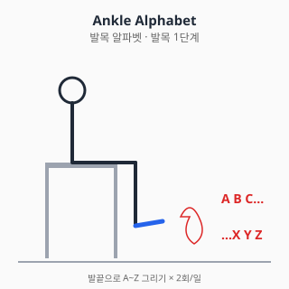
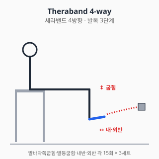
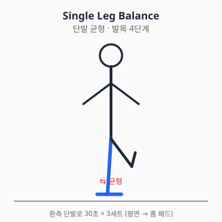

# 발목 통증 — 진단과 치료

<!-- DISCLAIMER_BANNER_AUTO -->

## 0. 해부학 개요

- **관절**: 거퇴관절(ankle joint, talocrural), 거골하관절(subtalar)
- **외측 인대 (3개)**: 전거비인대(ATFL), 종비인대(CFL), 후거비인대(PTFL)
- **내측 인대**: 삼각인대 (Deltoid ligament) — 강력
- **고원섬유결합 (Syndesmosis)**: 경비골 사이 인대 (high ankle sprain 부위)
- **건**: 아킬레스건, 비골근건(peroneus), 후경골건(tibialis posterior)

## 1. 흔한 증상·질환 (감별진단표 + 본문)

| 임상 양상 | 의심 질환 |
|---|---|
| 발목 내반(inversion) 손상 + 외측 부종·압통 | 외측 인대 염좌 (ATFL/CFL 호발) |
| 외반 손상 + 내측 통증 | 삼각인대 / 내과 골절 감별 |
| 점프·찍는 손상 후 종아리 후방 "뚝" 소리 + 발등굽힘 약화 | 아킬레스건 파열 |
| 만성 외측 통증 + 반복 염좌 + 불안정감 | 만성 외측 발목 불안정성 (CAI) |
| 발목 위쪽 통증 (외상 후) + 체중부하 시 악화 | 고원섬유결합 손상 (high ankle sprain) |
| 발목 후방 통증 + 평발 진행 | 후경골건 기능부전 (PTTD) |
| 외상 후 변형 + 즉시 체중부하 불가 | 골절 (응급) |

### 1.1 외측 발목 염좌 (가장 흔함)

- 내반 손상으로 ATFL 단독 또는 ATFL + CFL 손상이 흔함.
- 등급: Grade I (미세파열), Grade II (부분파열), Grade III (완전파열).
- 자연경과: 잘 치료된 I·II는 대부분 회복, III는 만성 불안정으로 진행 가능.
- **Ottawa Ankle Rules**: 골절 감별을 위한 임상 판단 기준 (영상검사 필요성 판단).

### 1.2 아킬레스건 파열

- 30~50대 운동 재개자, 갑작스런 점프·달리기·방향전환에서 호발.
- **Thompson test 양성**: 종아리 압박 시 발바닥쪽굽힘 소실.
- 가벼운 통증과 함께 "발로 차인 느낌"이 보고됨.
- 치료 방향: 수술 vs 보존(기능적 재활) — 두 옵션 모두 가이드라인.

### 1.3 만성 발목 불안정성 (CAI)

- 첫 염좌 후 약 30~70%가 만성 불안정성으로 진행한다는 보고.
- 기계적 불안정성 + 기능적 불안정성(고유감각 저하) 동반.

### 1.4 후경골건 기능부전 (PTTD)

- 중년 여성, 비만 위험인자. 평발 진행 + 발목 내측 통증.
- "Too many toes" sign: 뒤에서 봤을 때 환측 발가락이 더 많이 보임.

### 1.5 거골 골연골병변 (OCL)

- 외상성 또는 비외상성. 만성 통증·잠김·종창.
- MRI로 진단·병기 결정.

### 1.6 외상 후 관절염 (PTOA, Post-Traumatic Osteoarthritis) ⚠️

- **발목 손상 후 5~10년 이상 경과 시 가장 흔한 합병증**
- 인대 접합·재건술(Broström 등) 후에도 발생 가능 — 수술이 100% 예방하지 못함
- 부종·통증·관절 강직이 점진적으로 발현
- 활동 후 또는 날씨 변화 시 악화 흔함
- 진단: X-ray (관절 간격 좁아짐·골극·연골하 경화)
- 보존치료(NSAID·외용제·물리치료·운동·발목 보조기) 1차, 진행 시 관절경·관절고정술·인공관절치환술

### 1.7 인대 재건술 후 만성 합병증

- **재발성 불안정성**: 인대 재건술 후 5~15%에서 발생
- **관절 내 충돌증후군 (Impingement)**: 전방·후방 — 등반·발끝 동작 시 통증
- **금속 임플란트 자극**: 스크류·앵커 부위 통증
- **활액막염 / 점액낭염**: 만성 자극으로 발생
- **거골 골연골 병변 진행**: 무증상이었던 병변이 시간 경과 후 발현
- **신경병증성 통증**: 비복신경(sural nerve) 자극 등
- 6년 이상 경과 후 새로운 통증·부종 시 → **정형외과 재평가 권고**

## 2. 자가 체크리스트 (Red Flag)

- ✋ 외상 후 변형 / 즉시 체중부하 불가 (4걸음 못 디딤)
- 🌡️ 발열 + 발적·열감 (감염 감별)
- 🩸 종아리 위쪽까지 부종·열감 → DVT 감별
- 🦶 발등굽힘 약화 + 종아리 후방 "뚝" → 아킬레스 파열
- ⚖️ 양측성 + 체중감소 (전신질환 감별)

### Ottawa Ankle Rules (영상검사 필요 시점)

다음 중 **하나라도** 해당되면 X-ray 권고:

- 외측복사 후연 6cm 압통
- 내측복사 후연 6cm 압통
- 부상 직후 및 응급실에서 4걸음 체중부하 불가

## 3. 진단

### 3.1 신체검사

| 검사 | 평가 대상 |
|---|---|
| Anterior drawer test | ATFL |
| Talar tilt | CFL |
| Squeeze / External rotation test | 고원섬유결합 |
| Thompson test | 아킬레스건 파열 |
| Single leg heel rise | 후경골건 기능 |

### 3.2 영상검사

- **X-ray**: Ottawa rules 양성 시 / 외상 후 골절 평가
- **초음파**: 아킬레스건, 인대 평가
- **MRI**: OCL, 만성 통증, 수술 전 평가
- **스트레스 X-ray**: 만성 불안정성 평가

## 4. 치료

### 4.1 약물

> ⚠️ 처방약은 의사 처방·약사 복약지도 하에 사용. 본 섹션은 교육 목적.

#### A. 일반의약품 (OTC)

##### A-1. 아세트아미노펜 (타이레놀, paracetamol)

- **용량**: 성인 1회 500~1000mg, 1일 최대 4g (음주자·간질환자 2g 제한).
- **특징**: 진통·해열 위주. 위장 부담 적고 신장 영향 낮아 발목 염좌 초기 통증 조절에 1차 선택.
- **상호작용**: 만성 사용 시 와파린 INR 상승 가능.

##### A-2. 국소 NSAID (디클로페낙 겔/패치, 케토프로펜 패치, 케토톱, 볼타렌)

- 급성 발목 염좌에서 경구 NSAID 대안. **전신 노출 적어 위장·신장 부담 낮음** (NICE NG226).
- 광과민 주의 (특히 케토프로펜) — 햇볕 노출 부위 피하기.
- 65세 이상·CKD·심혈관 위험군 우선 권고.

##### A-3. 이부프로펜 (부루펜)

- **용량**: 성인 1회 200~400mg, 1일 최대 1200mg (OTC) / 3200mg (처방).
- **부작용**: 위장관 자극·신장 부담·심혈관 위험 (용량 의존).
- **염좌 회복에 NSAID 장기 사용은 인대·건 치유 지연 우려 보고**가 있음 (Su 2013).
- 단기·필요 시 사용 원칙. 5일 초과 시 의사 평가 권고.

##### A-4. 나프록센 (낙센, 탁센)

- **용량**: 1회 250~500mg, **1일 2회** (반감기 12~17시간으로 길어 이부프로펜 대비 복용 횟수 감소).
- 심혈관 위험은 비선택 NSAID 중 상대적으로 낮다는 보고 (Trelle BMJ 2011).
- 위장 부담은 이부프로펜과 유사하거나 다소 높음.

#### B. 처방약

##### B-1. 셀레콕시브 (쎄레브렉스, celecoxib)

- COX-2 선택적 NSAID. **GI 위험군에서 비선택 NSAID 대안** (위장 부작용 낮음).
- **용량**: 1회 100~200mg, 1일 1~2회.
- 심혈관 위험은 비슷하거나 약간 더 높을 수 있음 (PRECISION NEJM 2016).
- 플루코나졸 병용 시 셀레콕시브 혈중 농도↑.

##### B-2. 트라마돌 (울트라셋, 트리돌, tramadol)

- 약한 오피오이드 + SNRI 기전. NSAID 금기 환자 단기 보조.
- **부작용**: 어지러움·오심·변비·의존성. 노인 낙상 위험↑.
- **세로토닌 증후군**: SSRI·SNRI·듀록세틴 병용 회피.
- CYP2D6 억제제(아미오다론 등)와 병용 시 진통 효과 감쇄.

#### C. 국소 주사 (의사 시술 영역)

- **아킬레스건염에 코르티코스테로이드 주사**: **권고 안 함** (건 자체 주사는 파열 위험).
  주변 점액낭 주사는 제한적 적응.
- 거골하 관절·발목 관절강내 코르티코 주사는 OA·OCL 통증에 제한적 적응.
- **PRP·히알루론산**: 발목에서는 무릎만큼 근거 충분하지 않음. 진료 시 상의.

**주사 빈도·간격·부작용**
- 코르티코스테로이드 관절강 주사 횟수: **연 3~4회 이하** 권고 (관절 연골 손상·건 약화 위험 ↑). 동일 부위 재주사는 **최소 3개월 간격** 일반적 권고.
- 부작용 (코르티코 관절 주사): 일시적 통증 악화 (Steroid flare, 24~48시간), 피부 위축·탈색, 감염(드뭄), 혈당 상승 (당뇨 환자 주의), 건 약화 → 파열 위험.
- 금기·주의: 활동성 감염, 출혈 경향 (와파린·DOAC 사용 시 의사 판단), 조절 안 되는 당뇨, **임산부**(코르티코 전신 흡수 시 태아 영향 고려), 발목 인공 관절 부위.
- 주사 후 안내: 24~48시간 격렬한 운동·체중부하 회피, 부어오름·발열 지속 시 즉시 진료.

> 출처: ACR Steroid Joint Injection Guidelines / UpToDate "Intraarticular and soft tissue injections" (2023) / 식약처 의약품 안전사용 정보 (코르티코스테로이드)

#### D. 상호작용 풀세트

| 약물 A | 약물 B | 상호작용 |
|---|---|---|
| NSAID (이부프로펜·나프록센·셀레콕시브·디클로페낙) | 와파린 / DOAC | 출혈 위험↑ |
| NSAID | ACEi + 이뇨제 | Triple whammy AKI |
| NSAID | SSRI | GI 출혈↑ |
| NSAID | 리튬 | 리튬 독성 |
| NSAID | 메토트렉세이트 | 골수억제 |
| 트라마돌 | SSRI / SNRI / 듀록세틴 | 세로토닌 증후군 |
| 트라마돌 | CYP2D6 억제제 | 진통 감쇄 |
| 셀레콕시브 | 플루코나졸 | 셀레콕시브 혈중↑ |
| 이부프로펜 | 저용량 아스피린 | 항혈소판 효과 감쇄 |
| 아세트아미노펜 | 와파린 (만성) | INR 상승 |

#### 약물 섹션 출처

- 식약처 의약품안전나라. https://nedrug.mfds.go.kr (조회일: 2026-06-06)
- Su B, O'Connor JP. NSAID therapy effects on healing of bone, tendon, and
  the enthesis. J Appl Physiol. 2013;115:892-899.
  doi:10.1152/japplphysiol.00053.2013
- NICE CKS: Sprains and strains.
  https://cks.nice.org.uk/topics/sprains-strains/
- NICE NG226 (2022) Osteoarthritis pharmacology.
- Trelle S et al. BMJ 2011. 네트워크 메타분석.
- PRECISION trial. NEJM 2016.
- Stiell IG, et al. Ottawa Ankle Rules. JAMA. 1994;271:827-832.
  doi:10.1001/jama.1994.03510350037034

### 4.2 물리치료

#### 급성기 (0~3일)

- **POLICE**: Protection, Optimal Loading, Ice, Compression, Elevation
- 한랭치료 15~20분/회, 1일 3~4회
- 압박 붕대·테이핑 (RICE의 C·E)

#### 아급성기·만성기

- **도수치료**: 거골 후방 활주(posterior talar glide) — 발등굽힘 ROM 회복
- **고유감각 훈련**: 만성 불안정성 핵심
- **체외충격파**: 만성 아킬레스건염에서 비교적 강한 근거 (Rompe 2007)

#### 금기

- 골절 의심·확진 시 적극적 가동 금기 (의사 판단)
- 감염 의심 시 모달리티 금기

### 4.3 스트레칭·재활운동

#### 1단계 — 급성기 (0~3일)

- 발목 펌프 (능동 발등굽힘·발바닥쪽굽힘)
- **알파벳 운동**: 발끝으로 알파벳 그리기 — 전 방향 능동 ROM

  

  **앉은 자세에서 환측 발끝으로** 공중에 알파벳을 그린다. 무릎은
  움직이지 않게 고정하고 **발목 관절만** 사용. 큰 글씨로 천천히 그리면
  ROM 회복에 효과적.

#### 2단계 — ROM·등척성 (3일~2주)

- 수건 당김 (towel stretch) — 발등굽힘
- 등척성 4방향 (저항에 대한 발목 4방향 누름)

#### 3단계 — 근력 (2~6주)

- **세라밴드 4방향**: 발바닥쪽굽힘·발등굽힘·내반·외반 각 15회 × 3세트

  

  **외반(eversion) 강화가 만성 외측 불안정성 예방의 핵심** — 비골근 강화는
  발목 접질림 재발률을 낮춘다 (Vuurberg 2018).

- 발가락 들기, 발뒤꿈치 들기
- **카프 레이즈**: 양발 → 단발 진행. 단발 카프 레이즈 25회를 통증 없이
  할 수 있어야 점프·달리기 복귀 권고.

#### 4단계 — 균형·고유감각 (4~8주)

- 단발 균형: 평면 → 폼 패드 → BOSU 점진

  

  **눈 뜨고 30초** → **눈 감고 30초** → **폼 패드 위에서 30초** 순으로
  난이도 증가. 고유감각 훈련은 만성 발목 불안정성(CAI) 예방의 핵심
  (Vuurberg 2018).

- 균형 잡고 공 던지기·잡기 (외란 적용)

#### 5단계 — 기능·복귀

- 줄넘기, 종방향 점프, 측방 점프
- 방향 전환 드릴 (T-drill, 셔틀 런)

#### 운동 중단 신호

- 통증 NRS 5/10 초과 → 강도 하향
- 종아리 후방 "뚝" → 즉시 중단·진료
- 반복적 발목 꺾임 → 외측 인대 평가 필요

#### 물리·재활 출처

- Vuurberg G, et al. Diagnosis, treatment and prevention of ankle sprains:
  update of an evidence-based clinical guideline. Br J Sports Med.
  2018;52:956. doi:10.1136/bjsports-2017-098106
- Rompe JD, et al. Eccentric loading vs ESWT for chronic insertional
  achilles tendinopathy. Am J Sports Med. 2008;36(3):374-383.
  doi:10.1177/0363546507312164

## 5. 수술·전문의 의뢰 기준

### 5.1 외측 인대 재건술 (Broström, modified Broström)

- 만성 외측 불안정성 + 보존치료 3~6개월 실패

### 5.2 아킬레스건 봉합술

- 급성 완전파열 + 활동성 환자
- 수술 vs 보존(기능적 재활)은 환자 가치·재파열 위험 종합 판단
  (Soroceanu BMJ 2012).

### 5.3 거골 골연골병변 (OCL) 수술

- 보존치료 실패 + 큰 병변 → 미세천공술, 자가골연골이식 등

### 5.4 발목 인공관절치환술 / 관절고정술

- 말기 발목 OA: TAR(인공관절) vs Arthrodesis(관절고정)

### 5.5 응급·즉시 의뢰

- Ottawa rules 양성 + 변형 → 골절 평가
- 아킬레스건 파열 의심 → 정형외과 의뢰
- 감염 의심 → 응급실

### 의사 섹션 출처

- Stiell IG. Ottawa Ankle Rules. JAMA. 1994. (위)
- Soroceanu A, et al. Surgical vs nonsurgical treatment of acute Achilles
  tendon rupture: a meta-analysis. J Bone Joint Surg Am. 2012;94:2136-2143.
  doi:10.2106/JBJS.K.00917
- AAOS OrthoInfo: Ankle Sprain. https://orthoinfo.aaos.org/

## 6. 흔한 환자 상황별 안내

### 6.1 "발목 인대 수술 후 6년 지났는데 다시 부어요"
- **외상 후 관절염(PTOA) 가능성** — 수술 후 5~10년 이후 가장 흔한 원인
- 다른 가능성: 만성 불안정성 재발·관절 내 충돌증후군·금속 임플란트 자극·활액막염
- 6년 만에 새로운 통증·부종 시 → **정형외과 재평가 권고**
- 보존치료 1차 (NSAID·외용 NSAID·물리치료·발목 보조기·운동) → 진료 받으면서 단계적 결정

### 6.2 "수술 부위 주변이 점점 굳어요"
- 수술 후 관절 가동성 감소 — 보존적으로 ROM 운동 재시작
- 점진적이면 PTOA 진행 또는 관절 강직
- 동작 제한 50% 이상 시 진료

### 6.3 "장시간 보행 후 발목이 부어요"
- 수술 후 만성 변화로 흔한 증상
- 보존치료 (얼음·거상·외용 NSAID·발목 보조기)
- 점진적 악화 시 진료

### 6.4 "수술 후 그동안 괜찮았는데 갑자기 통증"
- 점진적 PTOA보다는 새로운 손상·미세 골절·OCL 가능성
- 외상 이력 점검
- 빠른 진료 권고

### 6.5 "수술 안 받은 반대쪽도 아파지기 시작"
- 보상 작용 가능성 — 한쪽 수술 후 반대쪽 부하 ↑
- 양쪽 모두 평가 권고

## 7. 통합 참고문헌

각 섹션 출처 참조.

## 8. 작성·검토·최종수정일

- 의사 / 약사 / 물치 / 재활: TBD
- 감사역 검수: 통과 (2026-06-06)
- 최종수정일: 2026-06-06
- 버전: 0.2.0
