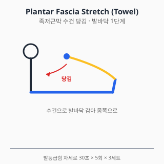
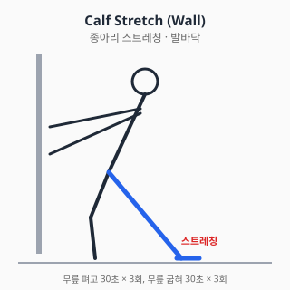

# 발바닥 통증 — 진단과 치료

<!-- DISCLAIMER_BANNER_AUTO -->

## 0. 해부학 개요

- **족근부 (Tarsal)**: 거골, 종골, 주상골, 입방골, 설상골
- **중족부 (Metatarsal)**: 중족골 5개 + 중족지절관절(MTP)
- **족지 (Phalanx)**: 발가락 14개
- **족저근막 (Plantar fascia)**: 종골 결절 → 중족골두에 부착, 종족궁 유지
- **건**: 후경골건, 비골근, 아킬레스건이 발바닥 역학에 기여

## 1. 흔한 증상·질환 (감별진단표 + 본문)

| 임상 양상 | 의심 질환 |
|---|---|
| 아침 첫걸음 시 발뒤꿈치 통증 | 족저근막염 (plantar fasciitis) |
| 발뒤꿈치 후방 부종·압통 | 아킬레스건 부착부염 / 후종골 점액낭염 |
| 발바닥 앞부분(중족골두) 통증 | 중족골통(metatarsalgia) / 모턴 신경종 |
| 3·4번 발가락 사이 저림·전기 통증 | 모턴 신경종 (Morton's neuroma) |
| 엄지발가락 MTP 통증 + 변형 | 무지외반증 (Hallux valgus) |
| 발가락 안쪽 손톱 부위 통증·발적 | 내성발톱 (ingrown toenail) |
| 발바닥에 단단한 굳은살 + 통증 | 굳은살(callus) / 사마귀 감별 |
| 야간통 + 발열 + 당뇨 | 당뇨발 감염 (응급) |

### 1.1 족저근막염 (Plantar Fasciitis)

- 가장 흔한 발바닥 통증 원인.
- 아침 첫걸음·오래 앉았다 일어날 때 종골 내측 결절 통증.
- 위험인자: 비만, 평발·요족, 장시간 서 있는 직업, 종아리·아킬레스 단축.
- 자연경과: 약 80~90%가 1년 이내 보존치료로 호전 보고.

### 1.2 모턴 신경종 (Morton's Neuroma)

- 3·4번 또는 2·3번 중족골 사이 지간신경 압박.
- 좁은 신발·하이힐과 연관.
- 신발 벗으면 호전, 좁은 신발에서 악화.

### 1.3 무지외반증 (Hallux Valgus)

- 엄지발가락이 외측으로 변형되며 MTP 내측 돌출.
- 유전·신발(좁은 toe box)·평발이 위험인자.
- 진단: 임상 + X-ray (HVA, IMA 측정).

### 1.4 중족골 피로골절 (Stress Fracture)

- 군인·러너·무용수 호발.
- 활동 후 점진적 통증, 압통 정확한 부위.
- 초기 X-ray 음성 빈번 → MRI·bone scan.

### 1.5 당뇨발 (Diabetic Foot)

- 당뇨 환자의 감각저하 + 변형 + 압력 분포 이상.
- **감염 동반 시 응급**: 발열, 발적, 화농, 악취.
- Charcot 관절병증 감별.

### 1.6 아킬레스 부착부염 / 후종골 점액낭염 (Haglund deformity)

- 종골 후상방 돌출 + 신발과 마찰.
- 만성 통증, 보행 시 악화.

## 2. 자가 체크리스트 (Red Flag)

- ✋ 외상 후 변형 / 체중부하 불가
- 🌡️ 발열 + 발적·화농·악취 (특히 당뇨) — 응급
- 🦶 야간통이 점점 심해짐 + 체중감소 (악성 감별)
- 💉 당뇨 + 신경 감각 저하 환자의 새로운 궤양·압박상처 — 즉시 진료
- 🦵 종아리 부종 + 통증 동반 → DVT 감별

## 3. 진단

### 3.1 신체검사

| 검사 | 평가 대상 |
|---|---|
| 종골 내측결절 압통 | 족저근막염 |
| Windlass test (엄지 신전 시 통증) | 족저근막염 |
| Mulder click | 모턴 신경종 |
| Tinel sign (족근관) | 족근관 증후군 |
| Single leg heel rise | 후경골건 |
| HVA / IMA 시진 | 무지외반증 |

### 3.2 영상검사

- **X-ray**: 무지외반증 각도, 골극, 변형, 피로골절 (초기 음성 가능)
- **초음파**: 족저근막 두께(4mm 초과 시 의심), 모턴 신경종
- **MRI**: 피로골절, 종양, 만성 통증 원인 불명
- **압력분포 분석**: 당뇨발 압력 위험 부위 평가

## 4. 치료

### 4.1 약물

> ⚠️ 처방약은 의사 처방·약사 복약지도 하에 사용. 본 섹션은 교육 목적.

#### A. 일반의약품 (OTC)

##### A-1. 아세트아미노펜 (타이레놀, paracetamol)

- **용량**: 성인 1회 500~1000mg, 1일 최대 4g (음주자·간질환자 2g 제한).
- 족저근막염·중족골통 초기 통증에 1차 선택. 위장 부담·신장 영향 적음.
- **간독성**: 4g/일 초과 시 위험. 만성 사용 시 와파린 INR 상승 가능.

##### A-2. 국소 NSAID (디클로페낙 겔/패치, 케토톱, 볼타렌)

- 족저근막염·중족골통 단기 보조. **전신 노출 적어 위장·신장 부담 낮음** (NICE NG226).
- 65세 이상·CKD·심혈관 위험군 우선 권고.
- 광과민 주의 (특히 케토프로펜).

##### A-3. 이부프로펜 (부루펜)

- **용량**: 1회 200~400mg, 1일 최대 1200mg (OTC).
- **부작용**: 위장관·신장·심혈관 (용량 의존).
- 단기 사용 (5일 이내). 만성 사용은 위장 출혈·신부전 위험.

##### A-4. 나프록센 (낙센, 탁센)

- **1일 2회** 복용 가능 (반감기 12~17시간).
- 위장 부담 있음. 심혈관 위험 상대적 낮음 (Trelle BMJ 2011).

#### B. 처방약

##### B-1. 셀레콕시브 (쎄레브렉스, celecoxib)

- COX-2 선택적 NSAID. **GI 위험군에서 비선택 NSAID 대안**.
- **용량**: 100~200mg, 1일 1~2회.
- 심혈관 위험 비슷하거나 약간 더 높음 (PRECISION NEJM 2016).

##### B-2. 트라마돌 (울트라셋, tramadol)

- 약한 오피오이드 + SNRI. NSAID 금기 시 단기 보조.
- **세로토닌 증후군**: SSRI·SNRI·듀록세틴 병용 회피.
- 의존성·노인 낙상 위험.

#### C. 국소 주사 (의사 시술 영역)

##### C-1. 코르티코스테로이드 — 족저근막

- 단기(4~12주) 통증 개선 보고. **족저근막 파열 위험 0.4~2.4%** 보고 (Acevedo 1998).
- 반복 시술 제한 (1년 3회 이내 권고), 의사 판단.

##### C-2. 모턴 신경종 주사

- 알코올 신경박멸술(alcohol sclerosis) 또는 스테로이드 주사.

##### C-3. 당뇨발 — 항생제 (감염 시)

- 항생제 선택은 균동정·중증도에 따라.
- 본 위키는 일반적 약제명만 기재, 처방은 의사 판단.

##### C-4. 주사 공통 안내 (부작용·금기·간격)

- 코르티코스테로이드 횟수: **연 3~4회 이하**, 동일 부위 재주사 **최소 3개월 간격**.
- 일반 부작용: Steroid flare (24~48h 통증 악화), 피부 위축·탈색, 감염(드뭄), 혈당 상승 (당뇨 환자 주의), 건·근막 약화 → 파열 위험.
- 금기·주의: 활동성 감염, 출혈 경향 (와파린·DOAC 사용 시 의사 판단), 조절 안 되는 당뇨, 임산부, 인공관절 부위.
- **수유 중**: 국소 코르티코 1회 주사는 일반적으로 모유 영향 미미하나 의사·약사와 사전 상담.
- 주사 후 24~48시간: 격렬한 운동·체중부하 회피. 발열·발적 지속 시 즉시 진료.

> 출처: UpToDate "Intraarticular and soft tissue injections" (2023) / 식약처 의약품 안전사용 정보

#### D. 외용제 / 보조

- 굳은살·티눈: 살리실산 패치 (각질용해), 의약외품·일반의약품
- 사마귀: 살리실산, 액화질소 — 의사 시술 권장

#### E. 상호작용 풀세트

| 약물 A | 약물 B | 상호작용 |
|---|---|---|
| NSAID (이부프로펜·나프록센·셀레콕시브·디클로페낙) | 와파린 / DOAC | 출혈 위험↑ |
| NSAID | ACEi + 이뇨제 | Triple whammy AKI |
| NSAID | SSRI | GI 출혈↑ |
| NSAID | 리튬 | 리튬 독성 |
| NSAID | 메토트렉세이트 | 골수억제 |
| 트라마돌 | SSRI / SNRI / 듀록세틴 | 세로토닌 증후군 |
| 트라마돌 | CYP2D6 억제제 | 진통 감쇄 |
| 셀레콕시브 | 플루코나졸 | 셀레콕시브 혈중↑ |
| 아세트아미노펜 | 와파린 (만성) | INR 상승 |
| 살리실산 (외용) | 와파린 | 흡수 시 INR↑ (이론적, 광범위 도포 시) |

#### 약물 섹션 출처

- 식약처 의약품안전나라. https://nedrug.mfds.go.kr (조회일: 2026-06-06)
- Acevedo JI, Beskin JL. Complications of plantar fascia rupture associated
  with corticosteroid injection. Foot Ankle Int. 1998;19(2):91-97.
  doi:10.1177/107110079801900207
- AAOS / AOFAS Clinical Practice Guideline.
  https://www.aaos.org/quality/quality-programs/foot-and-ankle-programs/
- NICE CKS: Plantar fasciitis.
  https://cks.nice.org.uk/topics/plantar-fasciitis/
- NICE NG226 (2022) Osteoarthritis pharmacology.
- Trelle S et al. BMJ 2011. 네트워크 메타분석.
- PRECISION trial. NEJM 2016.

### 4.2 물리치료

- **체외충격파(ESWT)**: 만성 족저근막염에 강한 근거 (FDA 승인 적응).
  6개월 이상 보존치료 실패 시 권고.
- **도수치료**: 족저근막 가동, 발목 발등굽힘 ROM 회복.
- **테이핑**: Low-Dye taping — 단기 통증 감소 보고.
- **온열치료**: 운동 전 종아리·족저근막 가열.

#### 금기

- 감염·당뇨발 궤양 부위 모달리티 금기
- 출혈 경향 환자에서 도수치료 신중

### 4.3 스트레칭·재활운동

#### 1단계 — 급성기

- **족저근막 스트레칭** (수건 당김): 발등굽힘 자세로 30초 × 5회 × 3세트

  

  **아침에 일어나기 전 침대에서 시행**하면 첫걸음 통증을 크게 줄일 수 있다
  (DiGiovanni 2003). 족저근막 특이적 스트레칭이 일반 종아리 스트레칭보다
  만성 종통(heel pain)에 더 효과적이라는 RCT.

- **종아리 스트레칭** (벽 짚기): 무릎 펴고/굽히고 각 30초 × 3회

  

  **무릎 펴고** = 비복근(gastrocnemius), **무릎 굽혀** = 가자미근(soleus)
  타겟. 둘 다 시행해야 종아리 단축이 충분히 풀린다.

- 한랭치료: 얼린 물병 발바닥에 굴리기 10~15분

#### 2단계 — 강화

- **발가락 구부려 수건 잡기 (Towel curl)**
- **발가락 들기 (Toe raise) / 발뒤꿈치 들기 (Heel raise)**
- **단족근 강화**: short foot exercise (종족궁 유지)

#### 3단계 — 균형·기능

- 단발 균형 30초
- 발가락만으로 걷기, 발뒤꿈치만으로 걷기

#### 신발·깔창

- **신발**: 충격흡수 + 종족궁 지지 (러닝화 등)
- **깔창(insole)**: 일반 OTC 깔창부터 시작, 보존치료 무반응 시 맞춤
  깔창(custom orthotics) 고려.

#### 운동 중단 신호

- 운동 후 통증이 다음 날도 지속 → 강도 하향
- 갑작스런 종아리·발뒤꿈치 "뚝" → 즉시 진료

#### 물리·재활 출처

- DiGiovanni BF, et al. Tissue-specific plantar fascia stretching exercise
  enhances outcomes for chronic heel pain. J Bone Joint Surg Am.
  2003;85(7):1270-1277. doi:10.2106/00004623-200307000-00013
- Martin RL, et al. Heel pain — plantar fasciitis: revision 2014.
  JOSPT Clinical Practice Guideline. doi:10.2519/jospt.2014.0303

## 5. 수술·전문의 의뢰 기준

### 5.1 족저근막 절개술 (Plantar Fascia Release)

- 6~12개월 보존치료 실패 + 영상 소견 일치
- 부분 절개가 일반적 (완전 절개는 종족궁 붕괴 위험)

### 5.2 무지외반증 교정술

- 통증 + 보행 장애 + 신발 적합성 문제
- HVA·IMA 정도에 따라 술식 선택 (chevron, scarf, Lapidus 등)

### 5.3 모턴 신경종 절제술

- 보존치료 + 주사 실패 시

### 5.4 당뇨발 외과적 처치

- 감염 동반 시 데브리망·절단 (응급)
- 압력 재분산 수술

### 5.5 응급·즉시 의뢰

- 당뇨 + 발 감염 의심 → 응급실
- 외상 후 변형 → 골절 평가
- 야간통 + 체중감소 → 악성종양 감별

### 의사 섹션 출처

- AAOS Clinical Practice Guideline. Diagnosis and Treatment of Heel Pain.
  https://www.aaos.org/
- 대한족부족관절학회 진료지침

## 6. 통합 참고문헌

각 섹션 출처 참조.

## 7. 작성·검토·최종수정일

- 의사 / 약사 / 물치 / 재활: TBD
- 감사역 검수: 통과 (2026-06-06)
- 최종수정일: 2026-06-06
- 버전: 0.2.0
