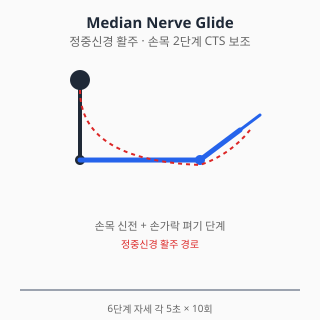
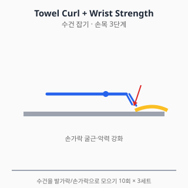

# 손목 통증 — 진단과 치료

<!-- DISCLAIMER_BANNER_AUTO -->

## 0. 해부학 개요

- **관절**: 요수근관절(distal radius–수근골), 수근중관절, 원위요척관절(DRUJ)
- **수근골 8개**: 주상골(scaphoid), 월상골(lunate), 삼각골, 두상골 등
- **TFCC** (Triangular Fibrocartilage Complex): 척측 손목 연골 복합체
- **수근관 (Carpal tunnel)**: 정중신경·9개 굴곡건 통과
- **신경**: 정중신경(수근관), 척골신경(Guyon관), 요골신경(요골관)

## 1. 흔한 증상·질환 (감별진단표 + 본문)

| 임상 양상 | 의심 질환 |
|---|---|
| 야간에 손가락 1~3,4 외측 저림·아림 + 손목 굽힘 시 악화 | 수근관 증후군 (CTS) |
| 엄지·손목 요측 통증 + 엄지 운동 시 악화 | 드퀘르벵 건초염 (de Quervain) |
| 손목 척측 통증 + 회전 시 악화 (병뚜껑 열기) | TFCC 손상 / 척측 충돌 |
| 손가락 굽힘 시 "딸깍" + 통증 | 방아쇠 수지 (trigger finger) |
| 외상 후 손목 부종·변형 + 압통 | 원위요골 골절 (Colles) / 주상골 골절 |
| 만성 손목 통증 + 활동 후 부종 | 손목 OA / 수근간 인대 손상 |
| 손등 무통 또는 약한 통증의 종괴 | 결절종 (Ganglion cyst) |
| 발열 + 손등 부종·발적 | 화농성 건초염 / 봉와직염 (응급) |

### 1.1 수근관 증후군 (Carpal Tunnel Syndrome, CTS)

- 정중신경의 수근관 내 압박. 가장 흔한 말초신경 압박병증.
- 위험인자: 여성, 비만, 임신, 당뇨, 갑상선저하증, 반복 손목 굴곡 직업.
- 증상: 야간통, 손 흔들면 호전(flick sign), 진행 시 무지구근 위축.
- 진단: 임상 + 신경전도검사(NCS) — 표준.

### 1.2 드퀘르벵 건초염 (de Quervain Tenosynovitis)

- 엄지의 단신근·장외전근 건초 협착.
- 산모·아이 안는 동작 호발.
- Finkelstein test 양성.

### 1.3 원위요골 골절 (Distal Radius Fracture)

- 가장 흔한 상지 골절. 노인 낙상·청년 외상.
- Colles 골절(원위 골편 후방 전위)이 대표적.
- 골다공증 평가 동반 필요.

### 1.4 주상골 골절 (Scaphoid Fracture)

- "Anatomical snuffbox" 압통이 핵심.
- 초기 X-ray 음성 빈번 → 임상 의심 시 MRI 또는 2주 후 재촬영.
- **놓치면 무혈성 괴사 위험** — 응급 의뢰 가치 있음.

### 1.5 TFCC 손상

- 척측 손목 통증 + 회전 시 악화.
- 외상성 vs 퇴행성. MRI 또는 관절경 진단.

### 1.6 방아쇠 수지 (Trigger Finger)

- A1 도르래 협착으로 굴곡건 걸림.
- 당뇨·류마티스 위험인자.

## 2. 자가 체크리스트 (Red Flag)

- ✋ 외상 후 변형 / 사용 불가
- 🌡️ 발열 + 손등 부종·발적·움직임 시 심한 통증 (화농성 건초염 응급)
- 🤲 무지구근 위축 (CTS 후기) → 즉시 진료
- 🩸 손가락 색깔 변화·감각 완전 소실 → 혈관·신경 응급
- 💉 류마티스 관절염 + 갑작스런 손목 변형 → 류마티스 전문의

### Kanavel's signs (화농성 건초염 4징후 — 응급)

1. 손가락이 약간 굽힌 상태로 유지
2. 손가락 건 주행을 따라 균일한 부종
3. 건 주행을 따라 압통
4. **수동 신전 시 극심한 통증** (가장 신뢰성 높음)

→ 응급실 즉시 의뢰.

## 3. 진단

### 3.1 신체검사

| 검사 | 평가 대상 |
|---|---|
| Tinel sign (손목) / Phalen test | CTS |
| Finkelstein test | 드퀘르벵 |
| Watson test (scaphoid shift) | 주상-월상 인대 |
| Anatomical snuffbox 압통 | 주상골 골절 |
| TFCC 압박 검사 | TFCC 손상 |
| Grip strength 측정 | 전반적 손목 기능 |

### 3.2 영상검사

- **X-ray**: PA, 측면, oblique. 주상골 의심 시 scaphoid view 추가
- **초음파**: 정중신경 단면적(CTS), 건초염, 결절종
- **MRI**: TFCC, 주상골 골절(X-ray 음성), 종양
- **신경전도검사(NCS) + EMG**: CTS 표준 진단

## 4. 치료

### 4.1 약물

> ⚠️ 처방약은 의사 처방·약사 복약지도 하에 사용. 본 섹션은 교육 목적.

#### A. 일반의약품 (OTC)

##### A-1. 아세트아미노펜 (타이레놀, paracetamol)

- **용량**: 성인 1회 500~1000mg, 1일 최대 4g (음주자·간질환자 2g 제한).
- 손목 OA·드퀘르벵 초기 통증 1차 선택. 위장 부담 적음.
- **간독성**: 4g/일 초과 위험. 만성 사용 시 와파린 INR 상승 가능.

##### A-2. 국소 NSAID (디클로페낙 겔/패치, 케토톱, 볼타렌)

- 드퀘르벵·방아쇠 수지 등 표재성 건초염에 효과적.
- 손목 OA 단기 보조. **전신 노출 적음** (NICE NG226).
- 65세 이상·CKD·심혈관 위험군 우선 권고.

##### A-3. 이부프로펜 (부루펜)

- **용량**: 1회 200~400mg, 1일 최대 1200mg (OTC).
- **부작용**: 위장관·신장·심혈관 (용량 의존).
- 단기 사용 (5일 이내). 만성 사용 시 위 출혈·신부전 위험.

##### A-4. 나프록센 (낙센, 탁센)

- **1일 2회** 복용 (반감기 12~17시간).
- 심혈관 위험 비선택 NSAID 중 상대적 낮음 (Trelle BMJ 2011).

#### B. 처방약

##### B-1. 셀레콕시브 (쎄레브렉스, celecoxib)

- COX-2 선택적 NSAID. **GI 위험군에서 비선택 NSAID 대안**.
- **용량**: 100~200mg, 1일 1~2회.

##### B-2. CTS — 단기 경구 스테로이드 (의사 판단)

- 단기 prednisolone (20mg/일, 2주) 일부 가이드라인에서 단기 호전 보고.
- 효과 한정적, 재발 흔함.
- 당뇨 환자 혈당 상승 주의.

##### B-3. 가바펜틴·프레가발린 (리리카) — CTS 신경병성 통증 보조

- 수술 대기 환자 야간통 보조. 근거는 제한적.
- **부작용**: 어지러움·졸음. 노인 낙상 위험.
- 알코올·오피오이드 병용 시 중추신경 억제 강화.

##### B-4. 트라마돌 (단기 보조)

- NSAID 금기·CTS 야간통이 심한 경우 단기 사용.
- **세로토닌 증후군**: SSRI·SNRI·듀록세틴 병용 회피.

#### C. 국소 주사 (의사 시술 영역)

##### C-1. CTS — 코르티코스테로이드 주사

- **단기·중기(1~6개월) 효과 강한 근거** (Marshall Cochrane 2007).
- 1년 시점에는 수술이 우월하다는 보고.
- 신경 직접 주사 위험 — 숙련된 의사 시술 필요.

##### C-2. 드퀘르벵 — 스테로이드 주사

- 1차 보존치료의 핵심. 70~85% 호전 보고 (Peters-Veluthamaningal 2009).
- 반복 시술 제한 (건 위축 위험).

##### C-3. 방아쇠 수지 — A1 도르래 주사

- 1~2회 주사로 50~70% 호전 보고.
- 당뇨 환자는 효과 낮고 재발 흔함.

##### C-4. 주사 공통 안내 (부작용·금기·간격)

- 코르티코스테로이드 횟수: **연 3~4회 이하**, 동일 부위 재주사 **최소 3개월 간격**.
- 일반 부작용: Steroid flare (24~48h 통증 악화), 피부 위축·탈색, 감염(드뭄), 혈당 상승 (당뇨 환자 주의), 건 약화 → 파열 위험.
- **CTS 주사 특이**: 정중신경 직접 주사 위험. 의사 숙련도 필요.
- **드퀘르벵 주사**: 반복 시술 시 건 위축 위험 — 의사가 횟수 제한.
- 금기·주의: 활동성 감염, 출혈 경향 (와파린·DOAC 사용 시 의사 판단), 조절 안 되는 당뇨, 임산부, 인공관절 부위.
- 수유 중: 국소 코르티코 1회 주사는 일반적으로 모유 영향 미미하나 의사·약사와 사전 상담.

> 출처: UpToDate "Carpal tunnel syndrome: Treatment and prognosis" (2024) / Marshall Cochrane 2007 / 식약처 의약품 안전사용 정보

#### D. 상호작용 풀세트

| 약물 A | 약물 B | 상호작용 |
|---|---|---|
| NSAID (이부프로펜·나프록센·셀레콕시브·디클로페낙) | 와파린 / DOAC | 출혈 위험↑ |
| NSAID | ACEi + 이뇨제 | Triple whammy AKI |
| NSAID | SSRI | GI 출혈↑ |
| NSAID | 리튬 | 리튬 독성 |
| NSAID | 메토트렉세이트 | 골수억제 |
| 가바펜틴·프레가발린 | 알코올·아편유사제 | 중추신경 억제↑ |
| 트라마돌 | SSRI / SNRI / 듀록세틴 | 세로토닌 증후군 |
| 트라마돌 | CYP2D6 억제제 | 진통 감쇄 |
| 단기 prednisolone | 당뇨약 | 혈당 상승 (당뇨 조절 악화) |
| 셀레콕시브 | 플루코나졸 | 셀레콕시브 혈중↑ |
| 아세트아미노펜 | 와파린 (만성) | INR 상승 |

#### 약물 섹션 출처

- 식약처 의약품안전나라. https://nedrug.mfds.go.kr (조회일: 2026-06-06)
- Marshall SC, et al. Local corticosteroid injection for carpal tunnel
  syndrome. Cochrane 2007;(2):CD001554. doi:10.1002/14651858.CD001554.pub2
- Peters-Veluthamaningal C, et al. Corticosteroid injection for de Quervain's
  tenosynovitis. Cochrane 2009;(3):CD005616.
  doi:10.1002/14651858.CD005616.pub2
- AAOS Clinical Practice Guideline. Management of Carpal Tunnel Syndrome.
  2016. https://www.aaos.org/quality/

### 4.2 물리치료

- **부목·보조기 (splint)**: CTS 야간 중립위 부목 — 1차 권고.
- **드퀘르벵**: 엄지 spica 부목.
- **체외충격파**: 드퀘르벵·테니스엘보 영역에서 일부 근거.
- **냉온 교대 욕(contrast bath)**: 부종·통증 보조.
- **이온영동(Iontophoresis)**: 일부 건초염에 보조.

#### 금기

- 화농성 건초염 의심 시 모든 모달리티 금기, 즉시 응급실
- 골절 의심·확진 시 적극 가동 금기

### 4.3 스트레칭·재활운동

#### 1단계 — 급성기

- 손가락 펴기·굽히기 능동 ROM (통증 없는 범위)
- 손목 펌프 (능동 굴곡·신전)
- 한랭치료 15분/회

#### 2단계 — Nerve gliding (CTS 보조)

- **정중신경 활주(Median nerve glide)**: 6단계 자세로 신경 활주 촉진

  

  - 주먹 → 손바닥 펴기 → 손목 신전 → 엄지 외전 → 손바닥 위로 →
    반대손으로 엄지 살짝 당기기
  - 각 자세 5초 유지, 10회 반복
  - 통증·저림이 심해지면 즉시 중단. 신경 자극이 강해지면 역효과
    (Wolny 2018).

#### 3단계 — 근력

- **악력 강화**: 스트레스 볼, 핸드 그리퍼 (저항 단계적)

  

  수건을 책상 위에 펴고 **손가락만으로 모으는 동작**. 굴근 강화의
  가장 안전한 시작 운동.

- **손목 굴근·신근 등척성** → **세라밴드 4방향**
- **엄지 외전·신전 강화**: 고무줄 저항 (드퀘르벵 회복기 핵심)

#### 4단계 — 기능 복귀

- 컴퓨터·스마트폰 사용자: 손목 중립위 유지 자세 교육
- 작업 빈도·시간 조절 (인간공학)

#### 운동 중단 신호

- 손저림·감각이상 증가 → 즉시 중단
- 통증 NRS 5/10 초과 → 강도 하향
- 손목 변형·새로운 부종 → 진료

#### 물리·재활 출처

- Page MJ, et al. Splinting for carpal tunnel syndrome. Cochrane 2012;(7):CD010003.
  doi:10.1002/14651858.CD010003
- Wolny T, Linek P. Neurodynamic techniques versus "sham" therapy in
  carpal tunnel syndrome. Arch Phys Med Rehabil. 2018;99(5):843-854.
  doi:10.1016/j.apmr.2017.12.005

## 5. 수술·전문의 의뢰 기준

### 5.1 수근관 유리술 (Carpal Tunnel Release)

- 보존치료(부목·주사) 실패
- 무지구근 위축·근력 저하 (수술 우선)
- 개방 vs 내시경 — 장기 결과 유사 보고

### 5.2 드퀘르벵 — 1차 도르래 절개술

- 보존치료 + 주사 2회 실패

### 5.3 원위요골 골절 — 정복·고정

- 비전위·안정성: 부목·캐스트
- 전위·관절면 침범: 관혈적 정복 + 내고정(ORIF, plate)

### 5.4 주상골 골절

- 비전위 안정성: 캐스트 6~12주
- 전위·근위부 골절: 수술 우선 (무혈성 괴사 위험)

### 5.5 화농성 건초염 — 응급 절개·배농

- Kanavel sign 양성 → 즉시 수부외과·응급실

### 5.6 응급·즉시 의뢰

- 외상 후 변형 → 골절 평가
- Kanavel sign → 응급실
- 새로 발생한 무지구근 위축 + 야간통 → 정형외과·신경과

### 의사 섹션 출처

- AAOS Clinical Practice Guideline. Management of Distal Radius Fractures.
  2020. https://www.aaos.org/
- AAOS Clinical Practice Guideline. Management of Carpal Tunnel Syndrome.
  2016. (위)
- 대한수부외과학회 진료지침

## 6. 통합 참고문헌

각 섹션 출처 참조.

## 7. 작성·검토·최종수정일

- 의사 / 약사 / 물치 / 재활: TBD
- 감사역 검수: 통과 (2026-06-06)
- 최종수정일: 2026-06-06
- 버전: 0.2.0
