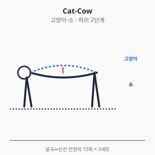
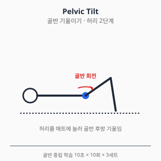
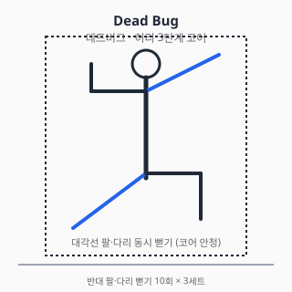
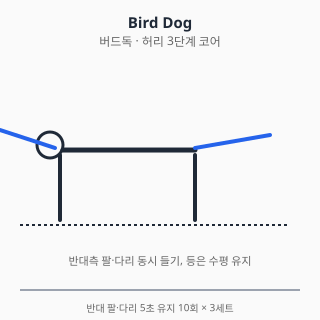
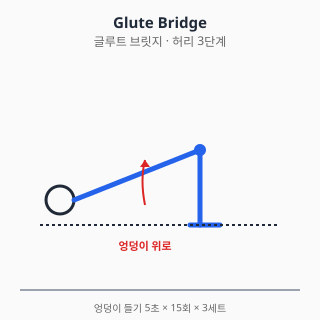

# 허리 통증 — 진단과 치료

<!-- DISCLAIMER_BANNER_AUTO -->

## 0. 해부학 개요

- **요추 (Lumbar spine)**: L1~L5 척추체 + 추간판
- **추간판 (Disc)**: 수핵(nucleus pulposus) + 섬유륜(annulus fibrosus)
- **후관절 (Facet joint)**: 척추 후방 관절
- **신경**: 척수신경근 L1~S1 출구, 마미(cauda equina) — L1 이하
- **근육**: 척추기립근, 다열근(multifidus), 요방형근, 대요근

## 1. 흔한 증상·질환 (감별진단표 + 본문)

| 임상 양상 | 의심 질환 |
|---|---|
| 갑작스런 허리 통증 + 6주 이내 호전 | 비특이성 급성 요통 (가장 흔함) |
| 다리로 방사되는 통증 + 저림 | 추간판 탈출증 / 신경근 압박 |
| 보행 시 다리 저림·통증, 앉으면 호전 | 척추관 협착증 (cervical claudication) |
| 노인, 갑작스런 등 통증 + 신장 감소 | 골다공증성 척추 압박골절 |
| 허리 통증 + 발열 + 야간통 + 체중감소 | 감염 / 악성종양 (Red Flag) |
| **대소변 장애 + 회음부 감각저하** | **마미증후군 (응급)** |
| 만성 후방 통증 + 회전·신전 시 악화 | 후관절증후군 (facet syndrome) |
| 청년기 + 아침 강직 1시간↑ + 휴식 시 악화 | 강직성 척추염 등 axSpA |

### 1.1 비특이성 요통 (Non-specific Low Back Pain)

- 가장 흔한 형태. 명확한 해부학적 원인 규명 어려운 경우.
- 자연경과: **약 90%가 6주 이내 호전**. 영상검사 1차 권고 안 함 (NICE NG59).
- 위험인자: 직업적 부하, 흡연, 비만, 우울, 신체활동 저하.

### 1.2 추간판 탈출증 (HIVD)

- L4-5, L5-S1 호발. 청·중년 호발.
- 좌골신경통(sciatica) — 둔부 → 다리 후방·외측 방사통.
- SLR test 양성 (30~70°에서 통증 재현).
- 자연경과: 다수가 6~12주 보존치료로 호전.

### 1.3 척추관 협착증 (Spinal Stenosis)

- 60대 이상 호발.
- 신경원성 파행: 보행 시 다리 저림·통증, 앉거나 굽히면 호전 (cf. 혈관성 파행).
- 만성 진행성.

### 1.4 척추 압박골절 (Vertebral Compression Fracture)

- 골다공증 + 경미한 외상 (재채기, 가벼운 낙상).
- 갑작스런 등 통증, 신장 감소.
- 영상: 척추 높이 감소 (≥20%).

### 1.5 마미증후군 (Cauda Equina Syndrome)

- **응급**: 즉시 응급실·신경외과.
- 거대 중심성 추간판 탈출, 종양, 외상 등.
- 4대 증상:
  1. 양측성 다리 통증·저림
  2. 안장 감각저하 (saddle anesthesia)
  3. 대소변 장애 (요폐·실금)
  4. 성기능 장애

### 1.6 강직성 척추염 / axSpA (Axial Spondyloarthritis)

- 청년기 (보통 45세 이전 발병).
- **염증성 요통의 4징후**:
  1. 아침 강직 1시간 이상
  2. 휴식 시 악화·활동 시 호전
  3. 야간 통증 (전반)
  4. 점진적 시작
- HLA-B27 연관. 류마티스내과 의뢰.

## 2. 자가 체크리스트 (Red Flag) — 매우 중요

다음 중 **하나라도** 해당되면 즉시 진료 (악성·감염·골절·마미 감별):

- 🚨 **대소변 장애·회음부 감각저하** → 마미증후군 응급
- 🩸 외상 후 즉시 통증 + 신경 증상
- 🌡️ 발열 + 야간통 + 체중감소 (악성·감염)
- 🔴 50세 초과 초발 또는 70세 초과
- 💉 면역억제·당뇨·정맥주사 약물 사용 (감염 위험)
- 🦴 골다공증 + 경미한 외상 후 갑작스런 등 통증 (압박골절)
- 📉 진행성 신경학적 결손 (점점 약해짐, 마비)
- 🌙 휴식 중에도 심해지는 통증 (악성 감별)

## 3. 진단

### 3.1 신체검사

| 검사 | 평가 대상 |
|---|---|
| SLR (Straight Leg Raise) | L4-L5, L5-S1 신경근 |
| Crossed SLR (반대측 양성) | 큰 디스크 탈출 |
| Femoral nerve stretch | L2-L4 |
| 마미 평가: 항문 긴장도, 회음부 감각 | 마미증후군 |
| Dermatome / Myotome | 신경근별 결손 위치 |
| Schober test | axSpA 척추 가동성 |

### 3.2 영상검사

- **1차 영상검사 권고 안 함 (NICE NG59 2016)**: 비특이성 급성 요통은 6주
  보존치료 우선.
- **X-ray**: 골절·정렬·종양 의심 시
- **MRI**: 신경 결손, 마미증후군, 6주 이상 만성, 적색신호 양성 시
- **CT**: 골 구조 평가
- **혈액검사**: CRP/ESR (감염·염증), CBC, ALP (악성)

## 4. 치료

### 4.1 약물

> ⚠️ 처방약은 의사 처방·약사 복약지도 하에 사용. 본 섹션은 교육 목적.

#### A. 일반의약품

##### A-1. 이부프로펜 / 나프록센 (경구 NSAID)

- **1차 권고** (NICE NG59 2016, ACP 2017): 급성·만성 비특이성 요통.
- **용량**: 이부프로펜 200~400mg q6~8h (OTC 최대 1200mg/일), 나프록센 220~440mg q12h.
- **요통 단기 사용 원칙**: 가급적 짧게 (1~2주), 최저 유효 용량.
- **위험 평가**: 위장관(고령·궤양 기왕력), 신장(CKD·이뇨제 병용), 심혈관(허혈성 심질환).
- **상호작용**: 와파린(출혈↑), ACEi/ARB+이뇨제(triple whammy AKI), 리튬·메토트렉세이트 농도↑, SSRI(GI 출혈↑).

##### A-2. 아세트아미노펜

- **단독 효과 미미** — Williams 2014 Lancet RCT에서 위약과 차이 없음. NICE NG59에서 권고 강도 약화.
- **위치**: NSAID 금기자에서 보조 1차. 1g q6h (최대 4g/일).
- **간 위험**: 음주자·만성 간질환자 2g/일 이하.
- **상호작용**: 와파린 (INR↑ 보고).

##### A-3. 국소 NSAID

- 요통에서 근거는 무릎·손 OA보다 약함 — 깊은 척추 근육·신경에 침투 한계.
- 표재성 근육통(요방형근·기립근)에는 보조 가능. 디클로페낙·케토프로펜 패치.

#### B. 처방약

##### B-1. 근이완제 (에페리손, 톨페리손, 사이클로벤자프린)

- **적응**: 급성 요통의 근경련 동반 시 단기 보조 (1~2주).
- **용법**: 에페리손 50mg q8h, 톨페리손 150mg q8h, 사이클로벤자프린 5~10mg q8h.
- **부작용**: 졸음·어지러움. 사이클로벤자프린은 강한 항콜린 작용 (구갈·요저류·고령 주의).
- **근거**: 단기 통증 개선 보고 있으나 장기 사용 권장 안 됨. 운전·기계조작 주의.

##### B-2. 트라마돌 / 약한 오피오이드

- **1차 권고 아님** (ACP 2017): 다른 옵션 실패 후 단기.
- **용법**: 50~100mg q6h (1일 최대 400mg, 고령 300mg).
- **위험**: 의존성·내성·금단, 세로토닌 증후군 (SSRI/SNRI 병용 시).
- **상호작용**: SSRI/SNRI/MAOI (세로토닌 증후군), CYP2D6 억제제 (효과 변동).

##### B-3. 가바펜틴 / 프레가발린 — 신경병증성 통증

- **추간판 탈출 좌골신경통에서 효과 제한적** (Mathieson NEJM 2017 — 위약과 차이 없음).
- 적응 외 사용 영역 흔함. 부작용(어지러움·졸림·체중증가) 대비 이익 작음.
- **신중 사용**. 처방하더라도 단기 시도 후 효과 평가.
- 신기능 저하 시 용량 감량 (가바펜틴은 100% 신배설).

##### B-4. 듀록세틴 — 만성 요통

- **ACP 2017 만성 요통 약한 권고**.
- 만성 요통 + 우울·신경병증성 동반 시 고려.
- **용법**: 30mg/일 시작 → 60mg/일 (식사 무관, 아침 권장).
- **상호작용**: SSRI·트라마돌 (세로토닌 증후군), 와파린·NSAID (출혈 위험↑).
- 금기: MAOI 병용, 조절되지 않은 협각녹내장.

##### B-5. 강력 오피오이드 (모르핀, 옥시코돈 등)

- **만성 요통에 권장 안 됨**: 이익 < 위험 (의존·과량·호흡억제).
- 단기·특수 상황(악성 통증·수술 직후)에서만 의사 판단.
- 한국에서 마약류 통합관리시스템(NIMS) 처방 보고 의무.

##### B-6. 경구 코르티코스테로이드 — 권장 안 됨

- 급성 좌골신경통에서 단기 사용 보고 있으나 (Goldberg JAMA 2015 일부 효과), **만성 요통에는 권장 안 됨**.
- 부작용 부담(고혈당·골소실·감염 위험) 대비 이익 제한적.

#### C. 국소 주사 (의사 시술 영역)

##### C-1. 경막외 스테로이드 주사 (Epidural Steroid Injection)

- **추간판 탈출 좌골신경통에 단기(2~6주) 통증 개선** 보고.
- 장기 효과·수술 회피 효과는 불일치.
- 빈도 제한 (연간 3~4회).

##### C-2. 후관절 주사 / 신경차단

- 후관절증후군 진단·치료 보조.
- 단기 효과 보고.

##### C-3. 주사 공통 안내 (부작용·금기·간격)

- 경막외·후관절 코르티코스테로이드 횟수: **연 3~4회 이하** 권고. 동일 부위 재주사는 **최소 3개월 간격** 일반적.
- 일반 부작용: Steroid flare (24~48h 통증 악화), 두통(경막천공 시), 일시적 혈당 상승 (당뇨 환자 주의), 감염 (드뭄), 출혈.
- 금기·주의: 활동성 감염, 출혈 경향 (와파린·DOAC·항혈소판 사용 시 의사가 중단 여부 판단), 조절 안 되는 당뇨, 임산부, 척추 수술 후 부착 부위.
- 수유 중: 경막외 1회 주사는 일반적으로 모유 영향 미미하나 의사·약사와 사전 상담.
- 주사 후 24~48시간: 격렬한 운동 회피, 두통·발열·하지 마비 진행 시 즉시 진료.

> 출처: NASS Clinical Guidelines (Lumbar Disc Herniation, 2014 update) / UpToDate "Subacute and chronic low back pain: Nonpharmacologic and pharmacologic treatment" (2024) / 식약처 의약품 안전사용 정보

#### D. 상호작용 풀세트

| 약물 A | 약물 B | 상호작용 |
|---|---|---|
| NSAID | 와파린 / DOAC | 출혈 위험↑ |
| NSAID | ACEi + 이뇨제 | Triple whammy AKI |
| NSAID | SSRI / SNRI | GI 출혈↑ |
| 트라마돌 | SSRI / SNRI | 세로토닌 증후군 |
| 가바펜틴 | 아편유사제 | 중추신경 억제↑ (호흡억제 보고) |
| 사이클로벤자프린 | MAOI | 고열·경련 위험 |
| 듀록세틴 | 와파린 | 출혈 위험↑ |
| 오피오이드 | 벤조디아제핀 | 호흡억제·사망 위험↑ |

#### 약물 섹션 출처

- 식약처 의약품안전나라. https://nedrug.mfds.go.kr (조회일: 2026-06-06)
- NICE Guideline NG59. Low back pain and sciatica in over 16s. 2016.
  https://www.nice.org.uk/guidance/ng59
- Qaseem A, et al. Noninvasive treatments for acute, subacute, and chronic
  low back pain: a clinical practice guideline from ACP. Ann Intern Med.
  2017;166(7):514-530. doi:10.7326/M16-2367
- Williams CM, et al. Efficacy of paracetamol for acute low-back pain.
  Lancet. 2014;384:1586-1596. doi:10.1016/S0140-6736(14)60805-9
- Mathieson S, et al. Trial of Pregabalin for Acute and Chronic Sciatica.
  N Engl J Med. 2017;376:1111-1120. doi:10.1056/NEJMoa1614292

### 4.2 물리치료

- **운동치료**: 만성 요통의 핵심 (NICE NG59 강한 권고).
- **도수치료(manipulation·mobilization)**: 운동치료 병행 시 효과 보고.
- **온열치료**: 단기 통증 보조 (Cochrane 2006).
- **TENS**: 근거 일관되지 않음, 보조 사용.
- **마사지·침**: NICE는 단독 권고하지 않음, 운동과 병행 시 보조.
- **요추 견인(traction)**: NICE 권고 안 함.

#### 금기

- 마미증후군·진행성 신경 결손·감염 의심 시 모든 모달리티 금기, 즉시 응급실
- 압박골절 급성기 도수치료 금기
- 항응고제 복용자 도수치료 신중

### 4.3 스트레칭·재활운동

#### 1단계 — 급성기 (0~2주)

- **활동 유지 (avoid bed rest)** — NICE NG59 강조: 절대 안정 금기.
- 통증 한도 내 일상 활동 유지.
- 한랭치료 15~20분 → 이후 온열로 전환.

#### 2단계 — 점진적 가동 (2~6주)

- **무릎 가슴으로 당기기 (Knee to chest)**: 좌골신경통 완화 자세
- **고양이-소 (Cat-cow)**: 척추 가동성

  

  네발기기 자세에서 **숨 들이마시며 등 내림(소)**, **숨 내쉬며 등 올림(고양이)**.
  요추 전체 가동성을 점진 회복.

- **펠빅 틸트 (Pelvic tilt)**: 골반 중립 학습

  

  누운 자세에서 **허리를 매트에 누르며 골반을 후방으로 기울인다**.
  허리 안정화의 기본 패턴 학습 운동.

#### 3단계 — 코어 강화 (만성기)

- **데드버그 (Dead bug)**: 누워서 반대쪽 팔·다리 뻗기 — 코어 안정성

  

  **허리는 매트에 누른 채로** 대각선 팔·다리를 천천히 뻗는다. 허리가
  들리면 강도를 낮춰야 한다. 코어 안정성과 신경근 조절을 동시에 훈련.

- **버드독 (Bird dog)**: 네발기기 자세에서 반대쪽 팔·다리 뻗기

  

  **등은 수평을 유지**하면서 반대측 팔·다리를 5초간 유지. 다열근
  활성에 효과적이라는 EMG 연구 (Stevens 2007).

- **사이드 플랭크 / 플랭크**: 측면·전방 코어
- **글루트 브릿지 (Glute bridge)**: 둔근 활성

  

  엉덩이를 들어올려 어깨–무릎이 일직선이 되게 한다. **둔근 약화는
  허리 통증의 흔한 동반 요인** — 둔근 강화는 만성 요통 재발 예방에 기여.

#### 4단계 — 통합 운동·기능

- **McGill big 3**: 컬업, 사이드 플랭크, 버드독 (McGill 2007 추천 조합)
- **걷기**: 만성 요통 가장 안전한 유산소
- **수영·자전거**: 충격 적은 유산소

#### 5단계 — 직무 복귀·재발 예방

- **인간공학**: 의자 높이, 모니터 위치, 들기 자세 교육
- **요추 안정화 패턴**: 들기 동작은 무릎 굽혀·등 펴고
- **유연성**: 햄스트링·고관절 굴근 (장요근) 스트레칭

#### 운동 중단 신호

- 다리 저림·감각이상 증가
- **대소변 장애·회음부 감각저하** → 즉시 응급실
- 통증 NRS 5/10 초과 → 강도 하향

#### 물리·재활 출처

- McGill SM. Low Back Disorders: Evidence-Based Prevention and Rehabilitation.
  3rd ed. Human Kinetics; 2016.
- French SD, et al. Superficial heat or cold for low back pain.
  Cochrane Database Syst Rev. 2006;(1):CD004750.
  doi:10.1002/14651858.CD004750.pub2
- Hayden JA, et al. Exercise therapy for chronic low back pain.
  Cochrane 2021;(9):CD009790. doi:10.1002/14651858.CD009790.pub2
- Stevens VK, et al. Trunk muscle activity in healthy subjects during
  bridging stabilization exercises. BMC Musculoskelet Disord. 2007;8:90.
  doi:10.1186/1471-2474-8-87

## 5. 수술·전문의 의뢰 기준

### 5.1 추간판절제술 (Discectomy / Microdiscectomy)

- **적응**: 6~12주 보존치료 실패 + MRI 일치 + 진행성 신경 결손
- **응급 적응**: 마미증후군 — 48시간 이내 수술 우선

### 5.2 척추관 협착증 — 감압술 (Laminectomy)

- 보행 거리 단축 + 보존치료 실패 + 영상 일치
- 단순 감압 vs 유합술 동반 — 환자별 판단

### 5.3 척추 압박골절 — 척추성형술 (Vertebroplasty / Kyphoplasty)

- 보존치료 실패 + 지속 통증 + 골다공증 평가·치료 동반.
- 효과 근거는 연구마다 불일치 (Buchbinder NEJM 2009).

### 5.4 척추 유합술 (Spinal Fusion)

- 불안정성, 척추전방전위증, 변형, 종양·외상.
- 비특이성 만성 요통에서의 유합술은 근거 약함, 신중.

### 5.5 응급·즉시 의뢰

- **마미증후군 의심** → 즉시 응급실
- 진행성 마비·근력저하
- 발열 + 야간통 + 체중감소 (감염·악성)
- 외상 후 신경 증상

### 의사 섹션 출처

- Buchbinder R, et al. A randomized trial of vertebroplasty for painful
  osteoporotic vertebral fractures. N Engl J Med. 2009;361:557-568.
  doi:10.1056/NEJMoa0900429
- 대한척추신경외과학회 / 대한정형외과학회 진료지침
- NICE Guideline NG59 (위)

## 6. 통합 참고문헌

각 섹션 출처 참조.

## 7. 작성·검토·최종수정일

- 의사 / 약사 / 물치 / 재활: TBD
- 감사역 검수: 통과 (2026-06-06)
- 최종수정일: 2026-06-06
- 버전: 0.2.0
